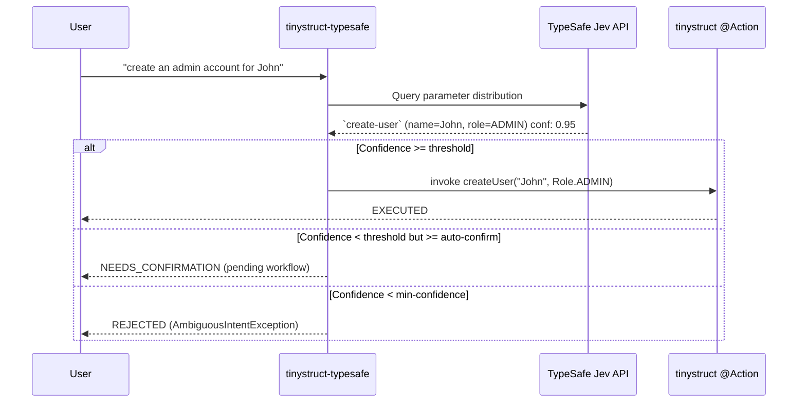

# tinystruct-typesafe

Language: [English](README.md) | [Português (Brasil)](docs/README.pt-BR.md) | [简体中文](docs/README.zh-CN.md) | [繁體中文](docs/README.zh-TW.md) | [日本語](docs/README.ja.md) | [한국어](docs/README.ko.md) | [Türkçe](docs/README.tr.md) | [Русский](docs/README.ru.md) | [Tiếng Việt](docs/README.vi.md) | [ไทย](docs/README.th.md) | [Deutsch](docs/README.de.md) | [Español](docs/README.es.md)

[](https://mvnrepository.com/artifact/org.tinystruct/tinystruct-typesafe-core)

> "Code owns the workflow; the model supplies programmable common sense."

**tinystruct-typesafe** lets natural language invoke existing tinystruct `@Action` methods, using **TypeSafe Jev** as a semantic dispatcher.

> [!IMPORTANT]
> This is **not** a chatbot. There is no prompt API and no chat abstraction. Jev answers typed questions by returning a probability distribution over options you supply. It never generates text or values, so every argument the action receives is either an enum constant, a boolean, or a verbatim span of the user's own input.

```bash
bin/dispatcher semantic --input "create an admin account for John"
# → create-user, name = John, role = ADMIN   (confidence 0.95)   → EXECUTED
```

---

## Table of Contents
- [Architecture Flow](#architecture-flow)
- [Modules](#modules)
- [Requirements](#requirements)
- [Making an action routable](#making-an-action-routable)
- [Configuration](#configuration)
- [Running](#running)
- [Security](#security)
- [Data at rest](#data-at-rest)
- [Creating Your Own Project](#creating-your-own-project)
- [Building](#building)

---

## Architecture Flow



---

## Modules

| Module | Purpose |
|---|---|
| `tinystruct-typesafe-client` | `TypesafeClient` over `POST /v1/systemone`, `RoutingRequest`/`RoutingResult`, `MockTypesafeClient` |
| `tinystruct-typesafe-core` | The dispatch pipeline, question generation, policies, cache, metrics, the `semantic` actions |
| `tinystruct-typesafe-workflow` | `ConfirmationService` on `tinystruct-workflow`: a pending call is a suspended, persisted workflow execution |
| `tinystruct-typesafe-demo` | User management, CRM and help desk example applications |

> [!NOTE]
> `core` does not depend on `tinystruct-workflow`. Without the workflow module, an action that needs confirmation is refused rather than run.

---

## Requirements

* Java 17
* **tinystruct 1.7.34 or later.** This project relies on a small framework change (see [Architecture.md](docs/Architecture.md#the-tinystruct-change)): `@Action(arguments = ...)` metadata now keeps order, `optional` and the parameter's Java type (as the argument's `type`), and string arguments convert to `Set`/`List` of enums. 
* A TypeSafe API key.

> [!TIP]
> If `tinystruct 1.7.34` is not on Maven Central yet, you can install it locally by cloning the `tinystruct` repository and running `mvn install`.

---

## Making an action routable

An action becomes routable when it is on the allowlist **and** every parameter is declared in `@Action(arguments = ...)`:

```java
@Action(value = "create-user",
        description = "Create a new user account with a name and a role.",
        arguments = {
            @Argument(key = "name", description = "The user's name."),
            @Argument(key = "role", description = "The role: ADMIN, EDITOR or VIEWER.")
        })
public String createUser(String name, Role role) { ... }
```

> [!TIP]
> The description is what the model reads, so write it for the model: **say what the action does, and what it does not.**

### How Parameters are Asked

| Parameter type | Asked as |
|---|---|
| `enum` | one `choice` question over the constants |
| `boolean` | one `noul` question |
| `Set<Enum>` / `List<Enum>` | one `noul` question per constant |
| `String`, numbers, `Date` | a `choice` over spans of the input, with a "not stated" option |

### ⚠️ Important Things to Know:

* **Arguments bind by position** (tinystruct's own rule), so a parameter can only be left out at the end, by providing an overload with fewer parameters. An optional parameter followed by a supplied one is refused.
* Values may not contain `/`, because tinystruct binds arguments from path segments.
* Overloads of an allowlisted action are not supported (the framework keeps one command description per name).
* Path templates (`user/{id}`) and built-ins (`start`, `generate`, ...) are never routable.
* An action declared for one mode (`HTTP_POST`, `CLI`, ...) is only routable from that mode.

---

## Configuration

Configure the application using `application.properties`:

| Key | Default | Description |
|---|---|---|
| `typesafe.api-key` | env `TYPESAFE_API_KEY` | **Required.** Your TypeSafe API key. |
| `typesafe.model` | `jev-latest` | Pin a version (`jev-1.13.0`) in production. |
| `typesafe.endpoint` | `https://api.typesafe.ai/v1/systemone` | The API endpoint for TypeSafe Jev. |
| `typesafe.routing.allowed-actions` | *empty* | **Comma-separated; nothing is routable until set.** |
| `typesafe.routing.confirm-actions` | *empty* | Always wait for a human, e.g. `delete-user`. |
| `typesafe.routing.min-confidence` | `0.80` | Below this score, the call is refused (`AmbiguousIntentException`). |
| `typesafe.routing.min-confidence.<action>` | | Per-action minimum confidence score. |
| `typesafe.routing.auto-confidence` | *off* | From the minimum up to this, ask for confirmation. |
| `typesafe.routing.set-threshold` | `0.5` | A set member is included at or above this probability. |
| `typesafe.routing.strategy` | `single` | `two-stage` sends the action question first, then only its arguments. |
| `typesafe.routing.confirmation-timeout-seconds` | `300` | Timeout before a pending confirmation expires. |
| `typesafe.validation.max-argument-length` | `200` | Max character length for arguments. |
| `typesafe.cache.provider` | `memory` | Cache type: `none`, `memory`, `redis`. |
| `typesafe.cache.ttl` | `3600` | Cache time-to-live in seconds. |
| `typesafe.confirmation.service` | *none* | Class name, e.g. `org.tinystruct.typesafe.workflow.WorkflowConfirmationService`. |
| `typesafe.principal.resolver` | built-in | Class name of a custom `PrincipalResolver`. |
| `typesafe.workflow.repository` | `memory` | Store type: `memory` (tests), `file`, `redis`, `database`. |
| `typesafe.workflow.snapshot-dir` | `workflow-snapshots/` | Storage directory for `file` repositories. |
| `typesafe.workflow.keep-completed` | `false` | Keep finished snapshots for audit. |
| `typesafe.logging.log-arguments` | `false` | Set to true to log values (can expose personal data). |
| timeouts/retries | `5000, 30000, 3, 1000` | Limits for HTTP 429 and 529 retry fallbacks. |

> [!NOTE]
> Redis settings follow tinystruct's own parameters: `redis.host`, `redis.port`, `redis.password`.

---

## Running

Everything runs through `bin/dispatcher`; there is no `main()`. The demo module is the runnable one:

```bash
# Builds everything and copies the demo's runtime jars into tinystruct-typesafe-demo/lib
mvn package
# or, using the Maven wrapper (no global Maven installation required):
./mvnw package                                   # Linux / macOS
# mvnw.cmd package                               # Windows

# Export API key (or set typesafe.api-key in application.properties)
export TYPESAFE_API_KEY=...                   

cd tinystruct-typesafe-demo

# Windows: bin\dispatcher.cmd
bin/dispatcher semantic --input "create an admin account for John"      
```

> [!WARNING]
> `bin/dispatcher` puts only `target/classes`, `lib/*.jar` and the tinystruct jar on the classpath, so **every module the applications use must be in `lib/`**. That is what `mvn package` does for the demo. Running a launcher from `core/` or `workflow/` fails with `NoClassDefFoundError: org/tinystruct/typesafe/client/TypesafeClient`, because the sibling modules are not on its classpath.

### CLI Commands

| Command | Action |
|---|---|
| `semantic --input "..."` | Run the pipeline. Result JSON: `status` is `EXECUTED`, `NEEDS_CONFIRMATION` (with `pendingId`) or `REJECTED` (with `reason`). |
| `semantic/confirm/<pendingId>` | Confirm a held call. |
| `semantic/reject/<pendingId>` | Cancel a held call. |
| `typesafe/metrics` | Returns system counters as JSON. |

> [!IMPORTANT]
> Each `bin/dispatcher` call is its own JVM (so `typesafe/metrics` counts only that call), and command-line use needs `typesafe.workflow.repository=file` (or `redis`/`database`); `memory` cannot carry a pending call from one command to the next.

---

## Security

1. **Opt-in allowlist.** Only allowlisted actions are offered to the model or routable. The default is empty.
2. **Values come from the input.** A free-text argument is always one of the spans that were offered; a value the model made up is refused. The model never writes an argument.
3. **Validation.** Every resolved argument is checked again (presence, enum membership, type, length, control characters, `/`) before anything runs, and again when a confirmed call finally executes.
4. **Confidence.** Below the minimum nothing runs. The score is the weakest link across the action choice and every argument used.
5. **Confirmation, failing closed.** A confirm-action, or a call in the confirm tier, is held. If no `ConfirmationService` is configured it is refused, never run.
6. **Confirm and reject are authorization.** They require the same principal that opened the call: a validated JWT subject, the session `userId`, or the HTTP session itself (`cli` on the command line). Request parameters are never trusted for identity.
7. **Mode and path safety.** The framework enforces each action's mode, and the dispatcher checks the call resolved to the allowlisted action, not another whose pattern also matched.
8. **Injection bounding.** Jev does not resist instructions inside the input. The controls above are what bound the damage: an injected instruction can at worst select another *allowlisted* action, and destructive ones wait for a human.

---

## Data at rest

A pending call's snapshot holds its arguments. It is deleted as soon as the call is confirmed, rejected, expired or failed (unless `typesafe.workflow.keep-completed=true`). A call that is never touched again stays until removed. 

> [!CAUTION]
> Restrict access to the snapshot directory (`file`) or the store (`redis`, `database`) and encrypt it at rest.

---

## Creating Your Own Project

To integrate **tinystruct-typesafe** into your own application:

1. **Add Dependencies**
   Add the following to your `pom.xml` (you can also optionally include `tinystruct-typesafe-workflow` if you need human-in-the-loop confirmation):
   ```xml
   <dependencies>
       <dependency>
           <groupId>org.tinystruct</groupId>
           <artifactId>tinystruct</artifactId>
           <version>1.7.34</version>
       </dependency>
       <dependency>
           <groupId>org.tinystruct</groupId>
           <artifactId>tinystruct-typesafe-core</artifactId>
           <version>1.0.0</version>
       </dependency>
   </dependencies>
   ```

2. **Configure application.properties**
   Create an `application.properties` file in your `src/main/resources` directory and define your API key and allowlist:
   ```properties
   typesafe.api-key=YOUR_API_KEY
   typesafe.routing.allowed-actions=create-user
   default.import.applications=com.example.MyApp
   ```

3. **Define Routable Actions**
   Create a standard `Application` class and ensure your `@Action` methods declare their arguments properly:
   ```java
   import org.tinystruct.AbstractApplication;
   import org.tinystruct.system.annotation.Action;
   import org.tinystruct.system.annotation.Argument;

   public class MyApp extends AbstractApplication {
       @Override
       public void init() {
           this.setTemplateRequired(false);
       }
       
       @Action(value = "create-user", description = "Create a user account",
               arguments = { @Argument(key = "name", description = "User's name") })
       public String createUser(String name) {
           return "Created " + name;
       }
       
       @Override
       public String version() { return "1.0"; }
   }
   ```

4. **Run via Dispatcher**
   Use the `bin/dispatcher` (or `bin/dispatcher.cmd`) script to route natural language commands:
   ```bash
   bin/dispatcher semantic --input "Please create a user named Alice"
   ```

---

## Building

```bash
mvn verify
# or, using the Maven wrapper (no global Maven installation required):
./mvnw verify    # Linux / macOS
mvnw.cmd verify  # Windows
```

Runs the tests of all four modules and enforces 90% line coverage on `client`, `core` and `workflow`. The tests use the real `ActionRegistry`, real actions and a real workflow engine; only TypeSafe is simulated.

### Further Reading
See [docs/Architecture.md](docs/Architecture.md) and [docs/DeveloperGuide.md](docs/DeveloperGuide.md).
