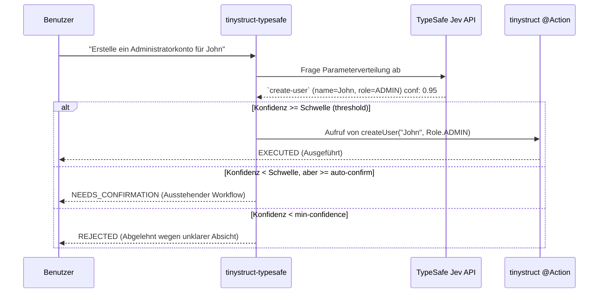

Language: [English](../README.md) | [Português (Brasil)](README.pt-BR.md) | [简体中文](README.zh-CN.md) | [繁體中文](README.zh-TW.md) | [日本語](README.ja.md) | [한국어](README.ko.md) | [Türkçe](README.tr.md) | [Русский](README.ru.md) | [Tiếng Việt](README.vi.md) | [ไทย](README.th.md) | [Deutsch](README.de.md) | [Español](README.es.md)

# tinystruct-typesafe

[](https://mvnrepository.com/artifact/org.tinystruct/tinystruct-typesafe-core)

> "Code besitzt den Workflow; das Modell liefert den programmierbaren gesunden Menschenverstand."

**tinystruct-typesafe** ermöglicht es Ihnen, vorhandene tinystruct `@Action` Methoden mit natürlicher Sprache aufzurufen, indem **TypeSafe Jev** als semantischer Dispatcher verwendet wird.

> [!IMPORTANT]
> Dies ist **kein** Chatbot. Es gibt keine Prompt-API und keine Chat-Abstraktion. Jev beantwortet strukturierte Eingaben, indem es eine Wahrscheinlichkeitsverteilung über die von Ihnen bereitgestellten Optionen zurückgibt. Es erfindet niemals Texte oder Werte. Daher ist jedes Argument, das die Aktion erhält, entweder eine Enum-Konstante, ein Boolean oder ein wörtlicher Abschnitt aus der eigenen Eingabe des Benutzers.

```bash
bin/dispatcher semantic --input "Erstelle ein Administratorkonto für John"
# → create-user, name = John, role = ADMIN   (Konfidenz 0.95)   → EXECUTED
```

---

## Inhaltsverzeichnis
- [Architekturablauf](#architekturablauf)
- [Module](#module)
- [Voraussetzungen](#voraussetzungen)
- [Eine Aktion routingfähig machen](#eine-aktion-routingfähig-machen)
- [Konfiguration](#konfiguration)
- [Ausführen](#ausführen)
- [Sicherheit](#sicherheit)
- [Daten im Ruhezustand (Data at rest)](#daten-im-ruhezustand-data-at-rest)
- [Erstellen eines eigenen Projekts](#erstellen-eines-eigenen-projekts)
- [Erstellen (Build)](#erstellen-build)

---

## Architekturablauf



---

## Module

| Modul | Zweck |
|---|---|
| `tinystruct-typesafe-client` | `TypesafeClient` über `POST /v1/systemone`, `RoutingRequest`/`RoutingResult`, `MockTypesafeClient` |
| `tinystruct-typesafe-core` | Dispatch-Pipeline, Fragengenerierung, Richtlinien, Cache, Metriken, Basis-`semantic`-Aktionen |
| `tinystruct-typesafe-workflow` | `ConfirmationService` aufbauend auf `tinystruct-workflow`: Ein ausstehender Aufruf läuft als angehaltener, persistierter Workflow. |
| `tinystruct-typesafe-demo` | Beispielanwendungen: Benutzerverwaltung, CRM und Helpdesk |

> [!NOTE]
> `core` ist nicht abhängig von `tinystruct-workflow`. Ohne das Workflow-Modul wird eine Aktion, die bestätigt werden muss, direkt abgelehnt und nicht angehalten.

---

## Voraussetzungen

* Java 17
* **tinystruct 1.7.34 oder neuer.** Dieses Projekt basiert auf einer geringfügigen Änderung am Framework (siehe [Architecture.md](Architecture.md#the-tinystruct-change)): `@Action(arguments = ...)` Metadaten behalten nun die Reihenfolge, die Eigenschaft `optional` und den Java-Typ des Parameters bei. Außerdem werden String-Argumente automatisch in ein `Set`/`List` von Enums umgewandelt.
* Ein TypeSafe API-Schlüssel.

> [!TIP]
> Wenn `tinystruct 1.7.34` noch nicht auf Maven Central verfügbar ist, können Sie es lokal installieren, indem Sie das `tinystruct`-Repository klonen und `mvn install` ausführen.

---

## Eine Aktion routingfähig machen

Eine Aktion wird routingfähig, wenn sie in der Freigabeliste (Allowlist) steht **und** jeder Parameter in `@Action(arguments = ...)` deklariert ist:

```java
@Action(value = "create-user",
        description = "Erstellt ein neues Benutzerkonto mit Namen und Rolle.",
        arguments = {
            @Argument(key = "name", description = "Der Name des Benutzers."),
            @Argument(key = "role", description = "Die Rolle: ADMIN, EDITOR oder VIEWER.")
        })
public String createUser(String name, Role role) { ... }
```

> [!TIP]
> Die Beschreibung (`description`) wird vom Modell gelesen. Schreiben Sie also für das Modell: **Geben Sie an, was die Aktion tut und was sie nicht tut.**

### Wie Parameter abgefragt werden

| Parametertyp | Fragestellung |
|---|---|
| `enum` | Eine `choice`-Frage über alle Konstanten |
| `boolean` | Eine Ja/Nein (`noul`)-Frage |
| `Set<Enum>` / `List<Enum>` | Eine Ja/Nein (`noul`)-Frage pro Konstante |
| `String`, Zahlen, `Date` | Eine `choice`-Frage über Abschnitte des Eingabetextes, mit der Option "nicht angegeben" |

### ⚠️ Wichtige Hinweise:

* **Argumente binden nach Position** (eine Regel von tinystruct). Daher kann ein Parameter nur am Ende weggelassen werden (indem ein Überladungsmethod bereitgestellt wird, der weniger Parameter akzeptiert). Ein weggelassener optionaler Parameter vor einem bereitgestellten Parameter führt zur Ablehnung.
* Werte dürfen kein `/` enthalten, da tinystruct Argumente aus URL-Pfadsegmenten bindet.
* Überladungen (Overloads) für eine Aktion in der Freigabeliste werden nicht unterstützt (das Framework behält nur eine Befehlsbeschreibung pro Name).
* Pfad-Vorlagen (`user/{id}`) und integrierte Befehle (`start`, `generate`, ...) sind niemals routingfähig.
* Eine Aktion, die für einen Modus (`HTTP_POST`, `CLI`, ...) deklariert ist, ist nur in diesem Modus routingfähig.

---

## Konfiguration

Konfigurieren Sie die App mit der `application.properties`:

| Schlüssel (Key) | Standard | Beschreibung |
|---|---|---|
| `typesafe.api-key` | env `TYPESAFE_API_KEY` | **Erforderlich.** Ihr TypeSafe API-Schlüssel. |
| `typesafe.model` | `jev-latest` | Legen Sie in der Produktion eine Version fest (z. B. `jev-1.13.0`). |
| `typesafe.endpoint` | `https://api.typesafe.ai/v1/systemone` | Der Endpoint für die TypeSafe Jev API. |
| `typesafe.routing.allowed-actions` | *leer* | **Kommagetrennt; nichts ist routingfähig, bis dies konfiguriert ist.** |
| `typesafe.routing.confirm-actions` | *leer* | Aktionen, die immer eine Bestätigung durch den Menschen erfordern (z. B. `delete-user`). |
| `typesafe.routing.min-confidence` | `0.80` | Unter diesem Wert wird der Aufruf abgelehnt (`AmbiguousIntentException`). |
| `typesafe.routing.min-confidence.<action>` | | Minimale Konfidenz für eine bestimmte Aktion. |
| `typesafe.routing.auto-confidence` | *aus* | Zwischen dem Minimum und diesem Wert werden Aufrufe zur Bestätigung angehalten. |
| `typesafe.routing.set-threshold` | `0.5` | Ein Wahrscheinlichkeitswert größer/gleich diesem Wert schließt ein Set-Element ein. |
| `typesafe.routing.strategy` | `single` | Bei `two-stage` wird zuerst die Aktion und erst danach die Parameter abgefragt. |
| `typesafe.routing.confirmation-timeout-seconds` | `300` | Zeitlimit (Sekunden), bis eine ausstehende Bestätigung verfällt. |
| `typesafe.validation.max-argument-length` | `200` | Maximale Zeichenlänge für Argumente. |
| `typesafe.cache.provider` | `memory` | Cache-Typ: `none`, `memory`, `redis`. |
| `typesafe.cache.ttl` | `3600` | Lebensdauer des Caches (Sekunden). |
| `typesafe.confirmation.service` | *keiner* | Klassenname, z. B. `org.tinystruct.typesafe.workflow.WorkflowConfirmationService`. |
| `typesafe.principal.resolver` | eingebaut | Klassenname eines benutzerdefinierten `PrincipalResolver`. |
| `typesafe.workflow.repository` | `memory` | Speichertyp: `memory` (für Tests), `file`, `redis`, `database`. |
| `typesafe.workflow.snapshot-dir` | `workflow-snapshots/` | Das Verzeichnis für das `file`-Repository. |
| `typesafe.workflow.keep-completed` | `false` | Behalte abgeschlossene Snapshots für Audit-Zwecke. |
| `typesafe.logging.log-arguments` | `false` | Wenn true, werden Parameterwerte protokolliert (kann persönliche Daten preisgeben). |
| timeouts/retries | `5000, 30000, 3, 1000` | Wiederholungs- und Backoff-Limits für HTTP 429- und 529-Fehler. |

> [!NOTE]
> Die Redis-Einstellungen folgen den tinystruct-eigenen Parametern: `redis.host`, `redis.port`, `redis.password`.

---

## Ausführen

Alles wird über den `bin/dispatcher` ausgeführt; es gibt keine `main()`-Methode. Das Demo-Modul ist die ausführbare Anwendung:

```bash
# Alles erstellen und die Jars der Demo nach tinystruct-typesafe-demo/lib kopieren
mvn package                                   

# Den API-Schlüssel exportieren (oder in der application.properties festlegen)
export TYPESAFE_API_KEY=...                   

cd tinystruct-typesafe-demo

# Windows: bin\dispatcher.cmd
bin/dispatcher semantic --input "Erstelle ein Administratorkonto für John"      
```

> [!WARNING]
> Der `bin/dispatcher` fügt nur `target/classes`, `lib/*.jar` und das tinystruct-Jar in den Classpath ein. Daher **muss jedes Modul, das Ihre Anwendung verwendet, im Ordner `lib/` liegen**. Genau das tut `mvn package` für das Demo-Modul. Wenn Sie den Launcher aus dem `core/` oder `workflow/`-Ordner ausführen, schlägt dies mit einem `NoClassDefFoundError` fehl, da die Geschwistermodule nicht im Classpath enthalten sind.

### CLI-Befehle

| Befehl | Aktion |
|---|---|
| `semantic --input "..."` | Führt die Pipeline aus. JSON-Ergebnis für `status`: `EXECUTED`, `NEEDS_CONFIRMATION` (mit `pendingId`) oder `REJECTED` (mit `reason`). |
| `semantic/confirm/<pendingId>` | Bestätigt und führt einen ausstehenden Aufruf aus. |
| `semantic/reject/<pendingId>` | Bricht einen ausstehenden Aufruf ab. |
| `typesafe/metrics` | Gibt die Systemmetriken (Counters) als JSON zurück. |

> [!IMPORTANT]
> Jeder Aufruf von `bin/dispatcher` läuft in einer eigenen JVM (weshalb `typesafe/metrics` nur den jeweiligen Lauf zählt). Daher ist für die CLI-Nutzung die Einstellung `typesafe.workflow.repository=file` (oder `redis`/`database`) erforderlich. `memory` kann einen anstehenden Aufruf nicht in einen nachfolgenden separaten Befehl übertragen.

---

## Sicherheit

1. **Freigabeliste (Opt-in).** Nur Aktionen auf der Freigabeliste werden dem Modell angeboten und sind routingfähig. Standardmäßig leer.
2. **Werte stammen aus der Eingabe.** Ein Freitextargument ist immer ein Abschnitt der ursprünglichen Benutzereingabe. Erfundene Werte des Modells werden abgelehnt. Das Modell schreibt niemals selbst ein Argument.
3. **Validierung.** Jedes aufgelöste Argument wird vor der Ausführung streng validiert (Vorhandensein, Enum-Zugehörigkeit, Datentyp, Länge, Steuerzeichen, Verbot von `/`) und nach Bestätigung erneut überprüft.
4. **Konfidenz (Confidence).** Alles unterhalb der Mindestkonfidenz wird nicht ausgeführt. Die Bewertung richtet sich nach dem schwächsten Glied aus Aktionsauswahl und allen verwendeten Argumenten.
5. **Bestätigung und Fail-Close.** Eine Aktion, die bestätigt werden muss oder in den Auto-Confirm-Bereich fällt, wird angehalten. Wenn kein `ConfirmationService` konfiguriert ist, wird der Aufruf direkt abgelehnt.
6. **Bestätigung und Ablehnung ist Autorisierung.** Sie erfordern das gleiche Principal (Identität), das den Aufruf initiiert hat: Einen überprüften JWT-Subject, die `userId` der Session oder die lokale CLI-Session (`cli`). Die Parameter der Anfrage werden niemals als Identität vertraut.
7. **Modus- und Pfadsicherheit.** Das Framework setzt den Modus (HTTP, CLI) pro Aktion durch. Der Dispatcher prüft, ob der aufgelöste Aufruf eine berechtigte Aktion ist und gleicht nicht nur ein Muster ab.
8. **Injektionsbeschränkung.** Jev bietet keinen speziellen Widerstand gegen Prompt-Injections. Die oben genannten Kontrollen begrenzen jedoch den Schaden erheblich: Eine injizierte Anweisung kann höchstens eine **andere Aktion aus der Freigabeliste** auswählen, und zerstörerische Aktionen warten ohnehin auf menschliche Bestätigung.

---

## Daten im Ruhezustand (Data at rest)

Der Snapshot eines ausstehenden Aufrufs enthält seine Argumente. Er wird sofort gelöscht, sobald der Aufruf bestätigt, abgelehnt, abgelaufen oder fehlgeschlagen ist (es sei denn, `typesafe.workflow.keep-completed=true`). Aufrufe, die niemand berührt, bleiben bestehen, bis sie bereinigt werden.

> [!CAUTION]
> Beschränken Sie den Zugriff auf das Snapshot-Verzeichnis (`file`) oder den Datenspeicher (`redis`, `database`) und verschlüsseln Sie gespeicherte Daten.

---

## Erstellen eines eigenen Projekts

So integrieren Sie **tinystruct-typesafe** in Ihre eigene Anwendung:

1. **Abhängigkeiten (Dependencies) hinzufügen**
   Fügen Sie dies Ihrer `pom.xml` hinzu (Sie können optional auch `tinystruct-typesafe-workflow` hinzufügen, wenn Sie Human-in-the-Loop-Bestätigungen benötigen):
   ```xml
   <dependencies>
       <dependency>
           <groupId>org.tinystruct</groupId>
           <artifactId>tinystruct</artifactId>
           <version>1.7.34</version>
       </dependency>
       <dependency>
           <groupId>org.tinystruct</groupId>
           <artifactId>tinystruct-typesafe-core</artifactId>
           <version>1.0.0</version>
       </dependency>
   </dependencies>
   ```

2. **application.properties konfigurieren**
   Erstellen Sie die Datei `application.properties` im Ordner `src/main/resources` und deklarieren Sie Ihren API-Schlüssel sowie die Freigabeliste:
   ```properties
   typesafe.api-key=IHR_API_SCHLÜSSEL
   typesafe.routing.allowed-actions=create-user
   default.import.applications=com.example.MyApp
   ```

3. **Routingfähige Aktionen definieren**
   Erstellen Sie eine Standard-`Application` und stellen Sie sicher, dass Argument-Metadaten für Ihre `@Action`-Methoden deklariert sind:
   ```java
   import org.tinystruct.AbstractApplication;
   import org.tinystruct.system.annotation.Action;
   import org.tinystruct.system.annotation.Argument;

   public class MyApp extends AbstractApplication {
       @Override
       public void init() {
           this.setTemplateRequired(false);
       }
       
       @Action(value = "create-user", description = "Erstellt ein Benutzerkonto",
               arguments = { @Argument(key = "name", description = "Name des Benutzers") })
       public String createUser(String name) {
           return "Created " + name;
       }
       
       @Override
       public String version() { return "1.0"; }
   }
   ```

4. **Über den Dispatcher ausführen**
   Verwenden Sie das `bin/dispatcher` (oder `bin/dispatcher.cmd`) Skript, um natürlichsprachliche Befehle weiterzuleiten:
   ```bash
   bin/dispatcher semantic --input "Bitte erstelle einen Benutzer namens Alice"
   ```

---

## Erstellen (Build)

```bash
mvn verify
```

Führt Tests für alle vier Module aus und erzwingt 90% Codeabdeckung (Line Coverage) für `client`, `core` und `workflow`. Die Tests verwenden eine echte `ActionRegistry`, echte Aktionen und eine echte Workflow-Engine; lediglich das Netzwerk zu TypeSafe wird gemockt.

### Weiterführende Literatur
Siehe [Architecture.md](Architecture.md) und [DeveloperGuide.md](DeveloperGuide.md).
