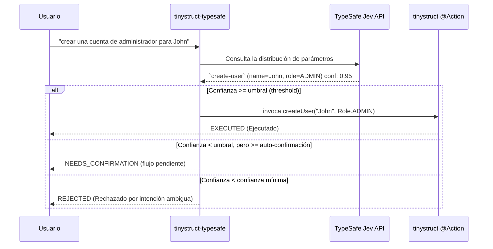

Language: [English](../README.md) | [Português (Brasil)](README.pt-BR.md) | [简体中文](README.zh-CN.md) | [繁體中文](README.zh-TW.md) | [日本語](README.ja.md) | [한국어](README.ko.md) | [Türkçe](README.tr.md) | [Русский](README.ru.md) | [Tiếng Việt](README.vi.md) | [ไทย](README.th.md) | [Deutsch](README.de.md) | [Español](README.es.md)

# tinystruct-typesafe

[](https://mvnrepository.com/artifact/org.tinystruct/tinystruct-typesafe-core)

> "El código es el dueño del flujo de trabajo; el modelo proporciona el sentido común programable."

**tinystruct-typesafe** te permite usar lenguaje natural para invocar métodos `@Action` de tinystruct ya existentes, usando **TypeSafe Jev** como despachador semántico.

> [!IMPORTANT]
> Esto **no** es un chatbot. No hay una API de prompts y no hay abstracción de chat. Jev responde a las entradas estructuradas devolviendo una distribución de probabilidad sobre las opciones que tú le proporcionas. Nunca genera o inventa textos ni valores. Por lo tanto, cada argumento que recibe la Acción es una constante enum, un booleano, o un fragmento literal proveniente de la propia entrada del usuario.

```bash
bin/dispatcher semantic --input "crear una cuenta de administrador para John"
# → create-user, name = John, role = ADMIN   (confianza 0.95)   → EXECUTED
```

---

## Tabla de Contenidos
- [Flujo de Arquitectura](#flujo-de-arquitectura)
- [Módulos](#módulos)
- [Requisitos](#requisitos)
- [Cómo hacer que una Acción sea enrutable](#cómo-hacer-que-una-acción-sea-enrutable)
- [Configuración](#configuración)
- [Ejecución](#ejecución)
- [Seguridad](#seguridad)
- [Datos en Reposo](#datos-en-reposo)
- [Creando tu Propio Proyecto](#creando-tu-propio-proyecto)
- [Construcción (Build)](#construcción-build)

---

## Flujo de Arquitectura



---

## Módulos

| Módulo | Propósito |
|---|---|
| `tinystruct-typesafe-client` | `TypesafeClient` mediante `POST /v1/systemone`, `RoutingRequest`/`RoutingResult`, y `MockTypesafeClient` |
| `tinystruct-typesafe-core` | Canal de despacho (dispatch pipeline), generación de preguntas, políticas, caché, métricas, acciones base de `semantic` |
| `tinystruct-typesafe-workflow` | Implementa el `ConfirmationService` usando `tinystruct-workflow`: las llamadas pendientes se ejecutan como un workflow suspendido y persistido. |
| `tinystruct-typesafe-demo` | Aplicaciones de ejemplo: Gestión de usuarios, CRM, y mesa de ayuda (help desk). |

> [!NOTE]
| El módulo `core` no depende de `tinystruct-workflow`. Si no tienes el módulo de workflow, una acción que requiera confirmación simplemente será rechazada en lugar de quedar suspendida.

---

## Requisitos

* Java 17
* **tinystruct 1.7.34 o superior.** Este proyecto depende de un pequeño cambio en el framework (ver [Architecture.md](Architecture.md#the-tinystruct-change)): los metadatos de `@Action(arguments = ...)` ahora retienen el orden de los parámetros, su propiedad `optional`, y el tipo Java; y los argumentos de tipo cadena se convierten automáticamente a un `Set`/`List` de Enums.
* Una API key de TypeSafe.

> [!TIP]
> Si `tinystruct 1.7.34` aún no se encuentra en Maven Central, puedes instalarlo localmente clonando el repositorio de `tinystruct` y ejecutando `mvn install`.

---

## Cómo hacer que una Acción sea enrutable

Una acción se vuelve enrutable cuando está en la lista de permitidos (allowlist) **y** cada parámetro está declarado en `@Action(arguments = ...)`:

```java
@Action(value = "create-user",
        description = "Crea una nueva cuenta de usuario con nombre y rol.",
        arguments = {
            @Argument(key = "name", description = "El nombre del usuario."),
            @Argument(key = "role", description = "El rol: ADMIN, EDITOR o VIEWER.")
        })
public String createUser(String name, Role role) { ... }
```

> [!TIP]
> La descripción (`description`) está diseñada para que el modelo la lea, por lo que debes escribirla pensando en él: **di exactamente lo que la acción hace y lo que no hace.**

### ¿Cómo se preguntan los parámetros?

| Tipo de Parámetro | Cómo se Pregunta |
|---|---|
| `enum` | una pregunta de tipo `choice` (opción múltiple) para todas las constantes |
| `boolean` | una sola pregunta de tipo `noul` (sí/no) |
| `Set<Enum>` / `List<Enum>` | una pregunta de tipo `noul` (sí/no) para cada constante |
| `String`, números, `Date` | un `choice` sobre los fragmentos de la entrada inicial del usuario, que incluye una opción "no indicado" |

### ⚠️ Cosas importantes a saber:

* **Los argumentos se enlazan por posición** (esta es la regla de tinystruct). Por lo tanto, un parámetro sólo puede omitirse al final (proporcionando una sobrecarga de método que acepte menos parámetros). Si se omite un parámetro opcional y luego se proporciona uno obligatorio, será rechazado.
* Los valores no pueden contener un `/`, porque tinystruct extrae (binds) los argumentos a partir de los segmentos del URL.
* Las sobrecargas de método para una acción en la allowlist no son compatibles (el framework guarda sólo una descripción de comando por nombre).
* Las rutas con plantillas (`user/{id}`) y los comandos integrados (`start`, `generate`, ...) nunca se pueden enrutar semánticamente.
* Una acción declarada para un modo (`HTTP_POST`, `CLI`, ...) solo será enrutable en ese modo.

---

## Configuración

Configura la aplicación usando el archivo `application.properties`:

| Clave (Key) | Por defecto | Descripción |
|---|---|---|
| `typesafe.api-key` | env `TYPESAFE_API_KEY` | **Requerido.** Tu API key de TypeSafe. |
| `typesafe.model` | `jev-latest` | En producción, asegura una versión específica (ej. `jev-1.13.0`). |
| `typesafe.endpoint` | `https://api.typesafe.ai/v1/systemone` | El punto de acceso (endpoint) para la API de TypeSafe Jev. |
| `typesafe.routing.allowed-actions` | *vacío* | **Separados por comas; nada es enrutable hasta que se defina.** |
| `typesafe.routing.confirm-actions` | *vacío* | Acciones que siempre requerirán confirmación humana (ej. `delete-user`). |
| `typesafe.routing.min-confidence` | `0.80` | Por debajo de esta puntuación, la llamada es rechazada (`AmbiguousIntentException`). |
| `typesafe.routing.min-confidence.<action>` | | Confianza mínima (min-confidence) para una acción específica. |
| `typesafe.routing.auto-confidence` | *apagado* | Desde el mínimo hasta este valor, las solicitudes quedan pendientes para confirmación. |
| `typesafe.routing.set-threshold` | `0.5` | Una probabilidad superior o igual a este umbral incluirá el elemento en el Set. |
| `typesafe.routing.strategy` | `single` | Si es `two-stage`, pregunta por la acción primero, y luego solo por sus parámetros. |
| `typesafe.routing.confirmation-timeout-seconds` | `300` | Tiempo de expiración (segundos) para que venza una confirmación pendiente. |
| `typesafe.validation.max-argument-length` | `200` | Longitud máxima (caracteres) permitida para los argumentos. |
| `typesafe.cache.provider` | `memory` | Tipo de caché: `none`, `memory`, `redis`. |
| `typesafe.cache.ttl` | `3600` | Tiempo de vida de la caché (segundos). |
| `typesafe.confirmation.service` | *ninguno* | Nombre de la clase, ej. `org.tinystruct.typesafe.workflow.WorkflowConfirmationService`. |
| `typesafe.principal.resolver` | integrado | Nombre de la clase de un `PrincipalResolver` personalizado. |
| `typesafe.workflow.repository` | `memory` | Tipo de almacenamiento: `memory` (para tests), `file`, `redis`, `database`. |
| `typesafe.workflow.snapshot-dir` | `workflow-snapshots/` | El directorio cuando el repositorio de almacenamiento es de tipo `file`. |
| `typesafe.workflow.keep-completed` | `false` | Indica si deben mantenerse las instantáneas completadas para auditoría. |
| `typesafe.logging.log-arguments` | `false` | Si es true, registrará los valores de los parámetros (puede exponer datos personales). |
| timeouts/retries | `5000, 30000, 3, 1000` | Límites para reintentar errores HTTP 429 y 529. |

> [!NOTE]
> Las configuraciones de Redis siguen los propios parámetros de tinystruct: `redis.host`, `redis.port`, `redis.password`.

---

## Ejecución

Todo se ejecuta a través del script `bin/dispatcher`; no hay ningún método `main()`. El módulo demo es la aplicación ejecutable:

```bash
# Compila todo y copia los jars del demo a tinystruct-typesafe-demo/lib
mvn package                                   

# Exporta el API key (o configúralo en el archivo application.properties)
export TYPESAFE_API_KEY=...                   

cd tinystruct-typesafe-demo

# En Windows: bin\dispatcher.cmd
bin/dispatcher semantic --input "crear una cuenta de administrador para John"      
```

> [!WARNING]
> El script `bin/dispatcher` solo añade `target/classes`, `lib/*.jar`, y el jar de tinystruct al classpath, por lo que **cada módulo que use tu aplicación debe estar dentro de la carpeta `lib/`**. Esto es exactamente lo que hace `mvn package` para el módulo de demostración. Ejecutar el lanzador directamente en `core/` o `workflow/` fallará arrojando un error `NoClassDefFoundError` ya que los módulos hermanos no se incluirán en el classpath.

### Comandos del CLI (Command Line Interface)

| Comando | Acción |
|---|---|
| `semantic --input "..."` | Ejecuta el proceso. En el resultado JSON, el `status` será `EXECUTED`, `NEEDS_CONFIRMATION` (incluyendo `pendingId`), o `REJECTED` (incluyendo `reason`). |
| `semantic/confirm/<pendingId>` | Confirma y ejecuta una solicitud pendiente. |
| `semantic/reject/<pendingId>` | Cancela una solicitud pendiente. |
| `typesafe/metrics` | Retorna los contadores del sistema en formato JSON. |

> [!IMPORTANT]
> Cada vez que llamas a `bin/dispatcher` se instancia una JVM distinta (por lo tanto, `typesafe/metrics` solo contará para esa ejecución), y utilizarlo desde línea de comandos requiere configurar `typesafe.workflow.repository=file` (o `redis`/`database`); `memory` es incapaz de transferir el estado de la llamada pendiente hacia un próximo comando separado.

---

## Seguridad

1. **La lista de permitidos (Allowlist) requiere adhesión explícita.** Solo las acciones en esta lista se le presentan al modelo y son enrutables. Por defecto está vacía.
2. **Los valores provienen de la entrada original.** Un argumento de texto libre será siempre uno de los fragmentos exactos introducidos por el usuario. Los valores inventados por el modelo son rechazados. El modelo jamás redacta un argumento por sí mismo.
3. **Validación Exhaustiva.** Todo argumento extraído se valida rigurosamente antes de su ejecución (presencia, pertenencia a enum, tipo de dato, longitud, caracteres de control, prohibición de usar `/`) y vuelve a validarse antes de ser ejecutado después de la confirmación.
4. **Confianza (Confidence).** Cualquier solicitud que esté por debajo del límite mínimo no se ejecutará en absoluto. La puntuación siempre obedece al eslabón más débil entre la elección de la acción y cada uno de los argumentos requeridos.
5. **Confirmaciones y cierre seguro (Fail-close).** Toda acción que requiera confirmación explícita (o que caiga en el rango de confirmación automática) quedará en espera. Si no hay un `ConfirmationService` configurado, la llamada simplemente es denegada y jamás llegará a ejecutarse.
6. **Las confirmaciones o cancelaciones son autorizaciones.** Requerirán de la misma identidad o entidad (principal) que originó la llamada: Un subject de un JWT verificado, un `userId` en la sesión web, o la sesión de línea de comandos (`cli`). Los parámetros recibidos nunca son usados ciegamente como identidad de usuario.
7. **Seguridad del modo de acceso.** El framework limita e impone fuertemente el modo en que operan las acciones (HTTP o CLI). El enrutador verificará a fondo si la solicitud final resuelta corresponde a una acción presente en la lista blanca, en lugar de confiar solo en un patrón (pattern match).
8. **Resistencia a Inyecciones de Prompts.** Jev no brinda defensas mágicas contra inyecciones a nivel modelo, pero los estrictos controles delineados más arriba restringen significativamente sus consecuencias: En el peor de los casos, un prompt malicioso solo lograría **seleccionar otra acción inofensiva permitida de la lista** (allowlist), pues las acciones verdaderamente destructivas permanecerán retenidas aguardando por la aprobación de un ser humano.

---

## Datos en Reposo

Las copias instantáneas de datos (snapshots) pertenecientes a solicitudes pendientes conservan los argumentos en espera. Tan pronto se confirme, deniegue, expire, o falle el requerimiento, éstos serán eliminados al momento (salvo si tienes `typesafe.workflow.keep-completed=true`). Las llamadas desatendidas y en estado de abandono quedarán registradas hasta ser borradas manualmente del sistema.

> [!CAUTION]
> Limita rigurosamente los accesos de usuario a tu carpeta de copias instantáneas (snapshot dir) (`file`), y/o bases de datos (`redis`, `database`), y cifra toda información guardada en reposo.

---

## Creando tu Propio Proyecto

Para integrar **tinystruct-typesafe** en tu propia aplicación:

1. **Añade las dependencias correspondientes**
   Agrega a tu archivo `pom.xml` (y de manera opcional incluye `tinystruct-typesafe-workflow` de hacer falta validaciones humanas interactivas o asíncronas):
   ```xml
   <dependencies>
       <dependency>
           <groupId>org.tinystruct</groupId>
           <artifactId>tinystruct</artifactId>
           <version>1.7.34</version>
       </dependency>
       <dependency>
           <groupId>org.tinystruct</groupId>
           <artifactId>tinystruct-typesafe-core</artifactId>
           <version>1.0.0</version>
       </dependency>
   </dependencies>
   ```

2. **Prepara application.properties**
   Crea el archivo `application.properties` en la carpeta `src/main/resources` para declarar de un solo golpe tu clave de acceso (API Key) e inicializar tu lista blanca:
   ```properties
   typesafe.api-key=YOUR_API_KEY
   typesafe.routing.allowed-actions=create-user
   default.import.applications=com.example.MyApp
   ```

3. **Define tus Acciones Enrutables (Routable Actions)**
   Declara apropiadamente una clase típica heredando de `Application`, corroborando que tus métodos `@Action` tengan metadatos completos y detallados para sus argumentos correspondientes:
   ```java
   import org.tinystruct.AbstractApplication;
   import org.tinystruct.system.annotation.Action;
   import org.tinystruct.system.annotation.Argument;

   public class MyApp extends AbstractApplication {
       @Override
       public void init() {
           this.setTemplateRequired(false);
       }
       
       @Action(value = "create-user", description = "Crea tu perfil y cuenta de usuario",
               arguments = { @Argument(key = "name", description = "El nombre deseado para este usuario") })
       public String createUser(String name) {
           return "Created " + name;
       }
       
       @Override
       public String version() { return "1.0"; }
   }
   ```

4. **Operaciones desde el Dispatcher**
   Lanza el script o consola correspondiente mediante `bin/dispatcher` (o bajo windows usando `bin/dispatcher.cmd`) para enviar comandos formulados con simple lenguaje natural para ser despachados internamente:
   ```bash
   bin/dispatcher semantic --input "Por favor crea un usuario con nombre Alice"
   ```

---

## Construcción (Build)

```bash
mvn verify
```

Se correrá por todos los tests englobados dentro del espectro de los cuatro módulos, garantizando un piso del 90% (Line Coverage) referente a la cobertura de código para los paquetes: `client`, `core` y el sistema de `workflow`. Las suites de prueba actúan consumiendo implementaciones verdaderas desde los componentes `ActionRegistry`, el ciclo vida local y las herramientas de `workflow`; lo único que es simulado localmente y de lo cual no depende es la ejecución del tráfico directo emitido contra las redes de TypeSafe.

### Más Información (Lectura Avanzada)
Contempla echarle también una mirada detallada a nuestros documentos: [Architecture.md](Architecture.md) y [DeveloperGuide.md](DeveloperGuide.md).
