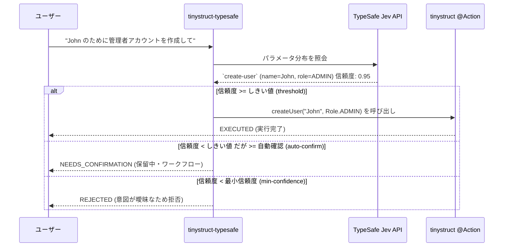

Language: [English](../README.md) | [Português (Brasil)](README.pt-BR.md) | [简体中文](README.zh-CN.md) | [繁體中文](README.zh-TW.md) | [日本語](README.ja.md) | [한국어](README.ko.md) | [Türkçe](README.tr.md) | [Русский](README.ru.md) | [Tiếng Việt](README.vi.md) | [ไทย](README.th.md) | [Deutsch](README.de.md) | [Español](README.es.md)

# tinystruct-typesafe

[](https://mvnrepository.com/artifact/org.tinystruct/tinystruct-typesafe-core)

> 「コードはワークフローを管理し、モデルはプログラム可能な常識を提供する。」

**tinystruct-typesafe** は、**TypeSafe Jev** をセマンティックディスパッチャとして使用することで、自然言語を使って既存の tinystruct `@Action` メソッドを呼び出すことができます。

> [!IMPORTANT]
> これはチャットボットでは**ありません**。プロンプト API やチャットの抽象化はありません。Jev は、あなたが提供したオプションの確率分布を返すことで、構造化された入力に応答します。テキストや値を自ら生成することは決してないため、アクションが受け取る各引数は、列挙型 (Enum) 定数、ブール値、またはユーザー入力からの逐語的なスパンのいずれかになります。

```bash
bin/dispatcher semantic --input "John のために管理者アカウントを作成して"
# → create-user, name = John, role = ADMIN   (信頼度 0.95)   → EXECUTED
```

---

## 目次
- [アーキテクチャフロー](#アーキテクチャフロー)
- [モジュール](#モジュール)
- [要件](#要件)
- [アクションをルーティング可能にするには](#アクションをルーティング可能にするには)
- [設定](#設定)
- [実行方法](#実行方法)
- [セキュリティ](#セキュリティ)
- [保存データ](#保存データ)
- [独自のプロジェクトを作成する](#独自のプロジェクトを作成する)
- [ビルド](#ビルド)

---

## アーキテクチャフロー



---

## モジュール

| モジュール | 目的 |
|---|---|
| `tinystruct-typesafe-client` | `POST /v1/systemone` に対する `TypesafeClient`、`RoutingRequest`/`RoutingResult`、`MockTypesafeClient`。 |
| `tinystruct-typesafe-core` | ディスパッチパイプライン、質問生成、ポリシー、キャッシュ、メトリクス、基本的な `semantic` アクション。 |
| `tinystruct-typesafe-workflow` | `tinystruct-workflow` に実装された `ConfirmationService`：保留中の呼び出しは、中断され永続化されたワークフロー実行として扱われます。 |
| `tinystruct-typesafe-demo` | サンプルアプリケーション：ユーザー管理、CRM、ヘルプデスク。 |

> [!NOTE]
> `core` は `tinystruct-workflow` に依存しません。workflow モジュールがない場合、確認が必要なアクションは保留されず拒否されます。

---

## 要件

* Java 17
* **tinystruct 1.7.34 以降。** このプロジェクトは tinystruct フレームワークの小さな変更（[Architecture.md](Architecture.md#the-tinystruct-change) 参照）に依存しています。`@Action(arguments = ...)` のメタデータがパラメータの順序、`optional` 属性、および Java 型を保持するようになり、文字列パラメータが列挙型の `Set`/`List` に自動変換されるようになりました。
* TypeSafe API キー。

> [!TIP]
> `tinystruct 1.7.34` がまだ Maven Central にない場合は、`tinystruct` リポジトリをクローンし、ローカルで `mvn install` を実行してインストールしてください。

---

## アクションをルーティング可能にするには

アクションが許可リスト（allowlist）に含まれ、**かつ**すべてのパラメータが `@Action(arguments = ...)` で宣言されている場合、そのアクションはルーティング可能になります。

```java
@Action(value = "create-user",
        description = "名前とロールを持つ新しいユーザーアカウントを作成します。",
        arguments = {
            @Argument(key = "name", description = "ユーザーの名前。"),
            @Argument(key = "role", description = "ロール：ADMIN、EDITOR、または VIEWER。")
        })
public String createUser(String name, Role role) { ... }
```

> [!TIP]
> `description` はモデルが読むためのものなので、モデルに向けて書いてください。**アクションが何をするのか、何をしないのかを明確にしてください。**

### パラメータの質問方法

| パラメータの型 | 質問のされ方 |
|---|---|
| `enum` | 全定数に対する一つの `choice` 質問 |
| `boolean` | 一つの `noul` (はい/いいえ) 質問 |
| `Set<Enum>` / `List<Enum>` | 定数ごとに一つの `noul` 質問 |
| `String`, 数値, `Date` | 入力テキストからスパンを抽出する `choice`（「指定なし」オプション付き） |

### ⚠️ 重要な注意事項：

* **引数は位置によってバインドされます**（tinystruct の独自ルール）。そのため、パラメータを省略できるのは末尾のみです（パラメータの少ないオーバーロードを提供することで対応）。必須パラメータが後続する場合、前の必須パラメータを省略すると拒否されます。
* 値に `/` を含めることはできません（tinystruct はパスセグメントから引数をバインドするため）。
* 許可リストにあるアクションのメソッドオーバーロードはサポートされていません（フレームワークは名前ごとに一つのコマンド説明しか保持しません）。
* パステンプレート（`user/{id}`）や組み込みコマンド（`start`、`generate` など）はルーティングできません。
* 特定のモード（`HTTP_POST`、`CLI` など）で宣言されたアクションは、そのモードでのみルーティング可能です。

---

## 設定

`application.properties` を使用してアプリケーションを設定します。

| キー (Key) | デフォルト値 | 説明 |
|---|---|---|
| `typesafe.api-key` | 環境変数 `TYPESAFE_API_KEY` | **必須。** TypeSafe API キー。 |
| `typesafe.model` | `jev-latest` | 本番環境では特定のバージョン（例：`jev-1.13.0`）に固定してください。 |
| `typesafe.endpoint` | `https://api.typesafe.ai/v1/systemone` | TypeSafe Jev API のエンドポイント。 |
| `typesafe.routing.allowed-actions` | *空* | **カンマ区切り。設定するまで何もルーティングされません。** |
| `typesafe.routing.confirm-actions` | *空* | 常に人間の確認が必要なアクション（例：`delete-user`）。 |
| `typesafe.routing.min-confidence` | `0.80` | このスコアを下回ると、呼び出しは拒否されます（`AmbiguousIntentException`）。 |
| `typesafe.routing.min-confidence.<action>` | | アクションごとの最小信頼度。 |
| `typesafe.routing.auto-confidence` | *オフ* | 最小信頼度からこの値までは、確認のために保留されます。 |
| `typesafe.routing.set-threshold` | `0.5` | 確率がこのしきい値以上の要素がセットに含まれます。 |
| `typesafe.routing.strategy` | `single` | `two-stage` の場合、最初にアクションを質問し、その後でパラメータを質問します。 |
| `typesafe.routing.confirmation-timeout-seconds` | `300` | 保留中の確認が期限切れになるまでのタイムアウト。 |
| `typesafe.validation.max-argument-length` | `200` | 引数の最大文字数。 |
| `typesafe.cache.provider` | `memory` | キャッシュの種類：`none`, `memory`, `redis`。 |
| `typesafe.cache.ttl` | `3600` | キャッシュの TTL（秒）。 |
| `typesafe.confirmation.service` | *なし* | クラス名（例：`org.tinystruct.typesafe.workflow.WorkflowConfirmationService`）。 |
| `typesafe.principal.resolver` | 組み込み | カスタム `PrincipalResolver` のクラス名。 |
| `typesafe.workflow.repository` | `memory` | ストレージの種類：`memory` (テスト用), `file`, `redis`, `database`。 |
| `typesafe.workflow.snapshot-dir` | `workflow-snapshots/` | `file` リポジトリ用の保存ディレクトリ。 |
| `typesafe.workflow.keep-completed` | `false` | 監査のために完了したスナップショットを保持するかどうか。 |
| `typesafe.logging.log-arguments` | `false` | true の場合、パラメータ値を記録します（個人データが漏洩する可能性があります）。 |
| timeouts/retries | `5000, 30000, 3, 1000` | HTTP 429 および 529 エラー時のリトライとバックオフ設定。 |

> [!NOTE]
> Redis の設定は、tinystruct 自身のパラメータ（`redis.host`, `redis.port`, `redis.password`）に従います。

---

## 実行方法

すべては `bin/dispatcher` を通じて実行され、`main()` メソッドはありません。デモモジュールが実行可能なアプリケーションです。

```bash
# 全てをビルドし、実行に必要な jar を tinystruct-typesafe-demo/lib にコピーします
mvn package                                   

# API キーをエクスポート（または application.properties に設定）
export TYPESAFE_API_KEY=...                   

cd tinystruct-typesafe-demo

# Windows の場合は bin\dispatcher.cmd を使用
bin/dispatcher semantic --input "John のために管理者アカウントを作成して"      
```

> [!WARNING]
> `bin/dispatcher` は `target/classes`、`lib/*.jar`、および tinystruct jar のみをクラスパスに追加するため、**アプリケーションが使用するすべてのモジュールは `lib/` フォルダにある必要があります。** これが `mvn package` がデモに対して行っていることです。`core/` や `workflow/` フォルダから直接ランチャーを実行すると、兄弟モジュールがクラスパスに含まれていないため、`NoClassDefFoundError` が発生して失敗します。

### CLI コマンド

| コマンド | アクション |
|---|---|
| `semantic --input "..."` | パイプラインを実行します。JSON 結果の `status` は `EXECUTED`、`NEEDS_CONFIRMATION`（`pendingId` 付き）、または `REJECTED`（`reason` 付き）になります。 |
| `semantic/confirm/<pendingId>` | 保留中の呼び出しを確認して実行します。 |
| `semantic/reject/<pendingId>` | 保留中の呼び出しをキャンセルします。 |
| `typesafe/metrics` | システムのメトリクスを JSON として返します。 |

> [!IMPORTANT]
> `bin/dispatcher` の各呼び出しは独自の JVM を持ちます（そのため `typesafe/metrics` はその呼び出しの分のみをカウントします）。また、コマンドラインでの使用には `typesafe.workflow.repository=file`（または `redis`/`database`）が必要です。`memory` は保留中の呼び出しを次のコマンドに引き継ぐことができません。

---

## セキュリティ

1. **許可リスト（Opt-in）。** 許可リスト（allowlist）に含まれるアクションのみがモデルに提示され、ルーティング可能になります。デフォルトは空です。
2. **値は入力から取得されます。** 自由記述の引数は常にユーザーの元の入力スパンのいずれかです。モデルが勝手に作成した値は拒否されます。モデルが引数を書くことはありません。
3. **検証（バリデーション）。** 解決されたすべての引数は、実行前に再度検証（存在、列挙型のメンバー、型、長さ、制御文字、`/` の禁止）され、確認された後にもう一度検証されます。
4. **信頼度（コンフィデンス）。** 最小信頼度を下回るものは一切実行されません。スコアは、アクションの選択と使用されるすべての引数のうち、最も低いものが適用されます。
5. **確認とフェイルクローズ。** 人間の確認が必要なアクション、または自動確認の範囲に該当する呼び出しは保留されます。`ConfirmationService` が設定されていない場合、呼び出しは拒否され、実行されることはありません。
6. **確認と拒否は承認（Authorization）です。** 呼び出しを開始したのと同じプリンシパル（検証済みの JWT サブジェクト、セッションの `userId`、または CLI ローカルセッション）が必要です。リクエストのパラメータが ID として信頼されることはありません。
7. **モードとパスの安全性。** フレームワークは各アクションのモード（HTTP、CLI など）を強制し、ディスパッチャはマッチしたパターンではなく、解決された呼び出しが許可リストのアクションであることをチェックします。
8. **インジェクションの制限。** Jev はプロンプトインジェクションへの特段の耐性を持ちません。しかし、上記の制御が被害を制限します。インジェクションされた命令は、せいぜい**許可リストにある**別のアクションを選択するだけであり、破壊的なアクションは人間の確認を待つことになります。

---

## 保存データ

保留中の呼び出しのスナップショットは、その引数を保持します。呼び出しが確認、拒否、期限切れ、または失敗すると、すぐに削除されます（`typesafe.workflow.keep-completed=true` の場合を除く）。誰も触れなかった呼び出しは、削除されるまで残ります。

> [!CAUTION]
> スナップショットディレクトリ（`file`）またはストア（`redis`, `database`）へのアクセスを制限し、保存データを暗号化してください。

---

## 独自のプロジェクトを作成する

**tinystruct-typesafe** を独自のアプリケーションに統合するには：

1. **依存関係の追加**
   `pom.xml` に以下を追加します（ヒューマンインザループの確認機能が必要な場合は、`tinystruct-typesafe-workflow` もオプションで追加できます）：
   ```xml
   <dependencies>
       <dependency>
           <groupId>org.tinystruct</groupId>
           <artifactId>tinystruct</artifactId>
           <version>1.7.34</version>
       </dependency>
       <dependency>
           <groupId>org.tinystruct</groupId>
           <artifactId>tinystruct-typesafe-core</artifactId>
           <version>1.0.0</version>
       </dependency>
   </dependencies>
   ```

2. **application.properties の設定**
   `src/main/resources` ディレクトリに `application.properties` を作成し、API キーと許可リストを定義します。
   ```properties
   typesafe.api-key=YOUR_API_KEY
   typesafe.routing.allowed-actions=create-user
   default.import.applications=com.example.MyApp
   ```

3. **ルーティング可能なアクションの定義**
   標準の `Application` クラスを作成し、`@Action` メソッドに引数のメタデータが正しく宣言されていることを確認します。
   ```java
   import org.tinystruct.AbstractApplication;
   import org.tinystruct.system.annotation.Action;
   import org.tinystruct.system.annotation.Argument;

   public class MyApp extends AbstractApplication {
       @Override
       public void init() {
           this.setAction("create-user", "createUser");
       }
       
       @Action(value = "create-user", description = "ユーザーアカウントを作成する",
               arguments = { @Argument(key = "name", description = "ユーザーの名前") })
       public String createUser(String name) {
           return "Created " + name;
       }
       
       @Override
       public String version() { return "1.0"; }
   }
   ```

4. **Dispatcher 経由での実行**
   `bin/dispatcher`（または `bin/dispatcher.cmd`）スクリプトを使用して、自然言語のコマンドをルーティングします。
   ```bash
   bin/dispatcher semantic --input "Alice というユーザーを作成してください"
   ```

---

## ビルド

```bash
mvn verify
```

4つのモジュールすべてのテストを実行し、`client`、`core`、`workflow` で 90% の行カバレッジを強制します。テストは実際の `ActionRegistry`、実際のアクション、実際のワークフローエンジンを使用し、TypeSafe への通信のみがシミュレートされます。

### 参考文献
詳細については [Architecture.md](Architecture.md) および [DeveloperGuide.md](DeveloperGuide.md) を参照してください。
