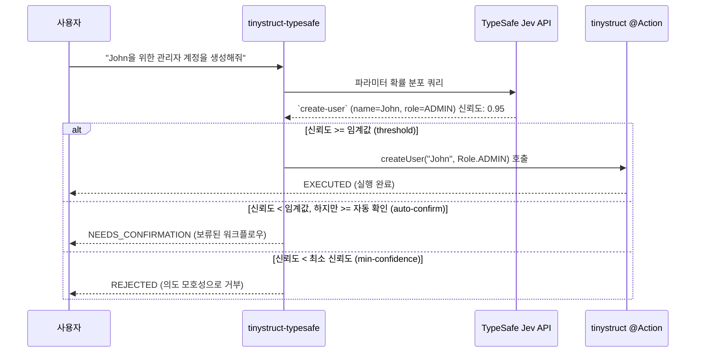

Language: [English](../README.md) | [Português (Brasil)](README.pt-BR.md) | [简体中文](README.zh-CN.md) | [繁體中文](README.zh-TW.md) | [日本語](README.ja.md) | [한국어](README.ko.md) | [Türkçe](README.tr.md) | [Русский](README.ru.md) | [Tiếng Việt](README.vi.md) | [ไทย](README.th.md) | [Deutsch](README.de.md) | [Español](README.es.md)

# tinystruct-typesafe

[](https://mvnrepository.com/artifact/org.tinystruct/tinystruct-typesafe-core)

> "코드가 워크플로우를 소유하고, 모델은 프로그래밍 가능한 상식을 제공합니다."

**tinystruct-typesafe** 는 **TypeSafe Jev**를 시맨틱 디스패처로 사용하여 자연어로 기존 tinystruct `@Action` 메서드를 호출할 수 있게 해줍니다.

> [!IMPORTANT]
> 이것은 챗봇이 **아닙니다**. 프롬프트 API나 채팅 추상화가 없습니다. Jev는 입력된 질문에 대해 사용자가 제공한 옵션에 대한 확률 분포를 반환하는 방식으로 응답합니다. 모델이 텍스트나 값을 스스로 만들어내지 않으므로 액션이 받는 모든 인수는 열거형(enum) 상수, 부울 값, 또는 사용자 입력의 그대로의 스팬(span) 중 하나입니다.

```bash
bin/dispatcher semantic --input "John을 위한 관리자 계정을 생성해줘"
# → create-user, name = John, role = ADMIN   (신뢰도 0.95)   → EXECUTED
```

---

## 목차
- [아키텍처 흐름](#아키텍처-흐름)
- [모듈](#모듈)
- [요구 사항](#요구-사항)
- [액션을 라우팅 가능하게 만들기](#액션을-라우팅-가능하게-만들기)
- [설정](#설정)
- [실행](#실행)
- [보안](#보안)
- [데이터 저장](#데이터-저장)
- [자신의 프로젝트 만들기](#자신의-프로젝트-만들기)
- [빌드](#빌드)

---

## 아키텍처 흐름



---

## 모듈

| 모듈 | 목적 |
|---|---|
| `tinystruct-typesafe-client` | `POST /v1/systemone`을 통한 `TypesafeClient`, `RoutingRequest`/`RoutingResult`, `MockTypesafeClient` |
| `tinystruct-typesafe-core` | 디스패치 파이프라인, 질문 생성, 정책, 캐시, 메트릭스, 기본 `semantic` 액션들 |
| `tinystruct-typesafe-workflow` | `tinystruct-workflow`의 `ConfirmationService` 구현체: 보류된 호출은 중단되고 영속화된 워크플로우 실행으로 처리됩니다. |
| `tinystruct-typesafe-demo` | 샘플 애플리케이션: 사용자 관리, CRM, 헬프 데스크 |

> [!NOTE]
> `core`는 `tinystruct-workflow`에 의존하지 않습니다. workflow 모듈이 없을 경우, 확인이 필요한 액션은 보류되지 않고 즉시 거부됩니다.

---

## 요구 사항

* Java 17
* **tinystruct 1.7.34 이상.** 이 프로젝트는 tinystruct 프레임워크의 사소한 변경 사항에 의존합니다 ([Architecture.md](Architecture.md#the-tinystruct-change) 참고). `@Action(arguments = ...)` 메타데이터는 이제 매개변수의 순서, `optional` 여부, 그리고 Java 타입을 유지하며, 문자열 인수는 열거형의 `Set`/`List`로 변환됩니다.
* TypeSafe API 키.

> [!TIP]
> 만약 `tinystruct 1.7.34`가 아직 Maven Central에 없다면, `tinystruct` 리포지토리를 클론하고 `mvn install`을 실행하여 로컬에 설치하세요.

---

## 액션을 라우팅 가능하게 만들기

액션이 화이트리스트(allowlist)에 있고, **또한** 모든 매개변수가 `@Action(arguments = ...)`에 선언되어야 라우팅이 가능해집니다:

```java
@Action(value = "create-user",
        description = "이름과 역할을 가진 새 사용자 계정을 생성합니다.",
        arguments = {
            @Argument(key = "name", description = "사용자의 이름."),
            @Argument(key = "role", description = "역할: ADMIN, EDITOR 또는 VIEWER.")
        })
public String createUser(String name, Role role) { ... }
```

> [!TIP]
> `description`은 모델이 읽기 위한 것이므로 모델을 위해 작성하세요: **액션이 무엇을 하는지, 무엇을 하지 않는지 명확히 하세요.**

### 파라미터가 질문되는 방식

| 파라미터 타입 | 질문 방식 |
|---|---|
| `enum` | 모든 상수에 대해 하나의 객관식(`choice`) 질문 |
| `boolean` | 하나의 예/아니오(`noul`) 질문 |
| `Set<Enum>` / `List<Enum>` | 각 상수별로 예/아니오(`noul`) 질문 |
| `String`, 숫자, `Date` | 사용자의 입력 스팬(span)에 대한 객관식(`choice`), "명시되지 않음" 옵션 포함 |

### ⚠️ 중요한 사항:

* **인수는 위치에 의해 바인딩됩니다** (tinystruct의 자체 규칙). 따라서 인수가 적은 오버로드를 제공함으로써 매개변수는 맨 끝에서만 생략될 수 있습니다. 선택적 매개변수를 생략하고 그 뒤의 필수 매개변수를 제공하면 거부됩니다.
* 값에는 `/`가 포함될 수 없습니다 (tinystruct는 경로 세그먼트에서 인수를 바인딩하기 때문입니다).
* 화이트리스트에 있는 액션의 오버로드는 지원되지 않습니다 (프레임워크는 이름당 하나의 명령 설명만 유지합니다).
* 경로 템플릿(`user/{id}`)이나 내장 명령(`start`, `generate` 등)은 라우팅할 수 없습니다.
* 특정 모드(`HTTP_POST`, `CLI` 등)로 선언된 액션은 해당 모드에서만 라우팅 가능합니다.

---

## 설정

`application.properties`를 사용하여 애플리케이션을 설정합니다:

| 키 (Key) | 기본값 | 설명 |
|---|---|---|
| `typesafe.api-key` | 환경변수 `TYPESAFE_API_KEY` | **필수.** TypeSafe API 키. |
| `typesafe.model` | `jev-latest` | 프로덕션에서는 버전(예: `jev-1.13.0`)을 고정하세요. |
| `typesafe.endpoint` | `https://api.typesafe.ai/v1/systemone` | TypeSafe Jev API 엔드포인트. |
| `typesafe.routing.allowed-actions` | *비어 있음* | **쉼표로 구분됨; 설정될 때까지 라우팅할 수 없습니다.** |
| `typesafe.routing.confirm-actions` | *비어 있음* | 항상 인간의 확인이 필요한 액션 (예: `delete-user`). |
| `typesafe.routing.min-confidence` | `0.80` | 이 점수 미만인 경우 호출이 거부됩니다 (`AmbiguousIntentException`). |
| `typesafe.routing.min-confidence.<action>` | | 특정 액션별 최소 신뢰도. |
| `typesafe.routing.auto-confidence` | *끄기* | 최소 신뢰도와 이 값 사이의 요청은 확인을 위해 보류됩니다. |
| `typesafe.routing.set-threshold` | `0.5` | 확률이 이 임계값 이상인 경우 집합(Set) 멤버에 포함됩니다. |
| `typesafe.routing.strategy` | `single` | `two-stage`인 경우 먼저 액션을 질문한 후, 그 매개변수만 질문합니다. |
| `typesafe.routing.confirmation-timeout-seconds` | `300` | 보류된 확인이 만료되기 전까지의 타임아웃(초). |
| `typesafe.validation.max-argument-length` | `200` | 인수의 최대 문자 길이. |
| `typesafe.cache.provider` | `memory` | 캐시 종류: `none`, `memory`, `redis`. |
| `typesafe.cache.ttl` | `3600` | 캐시 유지 시간(초). |
| `typesafe.confirmation.service` | *없음* | 클래스명 (예: `org.tinystruct.typesafe.workflow.WorkflowConfirmationService`). |
| `typesafe.principal.resolver` | 빌트인 | 사용자 지정 `PrincipalResolver`의 클래스명. |
| `typesafe.workflow.repository` | `memory` | 저장소 종류: `memory` (테스트), `file`, `redis`, `database`. |
| `typesafe.workflow.snapshot-dir` | `workflow-snapshots/` | `file` 리포지토리를 위한 저장 디렉토리. |
| `typesafe.workflow.keep-completed` | `false` | 감사를 위해 완료된 스냅샷을 유지할지 여부. |
| `typesafe.logging.log-arguments` | `false` | true일 경우 매개변수 값을 기록합니다(개인 데이터가 노출될 수 있음). |
| timeouts/retries | `5000, 30000, 3, 1000` | HTTP 429 및 529 에러에 대한 폴백/재시도 제한. |

> [!NOTE]
> Redis 설정은 tinystruct 자체 파라미터(`redis.host`, `redis.port`, `redis.password`)를 따릅니다.

---

## 실행

모든 것은 `bin/dispatcher`를 통해 실행되며 `main()` 메서드는 없습니다. 데모 모듈이 실행 가능한 애플리케이션입니다:

```bash
# 모든 것을 빌드하고 데모의 실행용 jar를 tinystruct-typesafe-demo/lib에 복사합니다
mvn package                                   

# API 키를 내보내기 (또는 application.properties에 설정)
export TYPESAFE_API_KEY=...                   

cd tinystruct-typesafe-demo

# Windows의 경우: bin\dispatcher.cmd
bin/dispatcher semantic --input "John을 위한 관리자 계정을 생성해줘"      
```

> [!WARNING]
> `bin/dispatcher`는 `target/classes`, `lib/*.jar` 및 tinystruct jar만 클래스 패스에 넣기 때문에 **애플리케이션이 사용하는 모든 모듈은 `lib/` 폴더에 있어야 합니다.** 이것이 `mvn package`가 데모를 위해 수행하는 작업입니다. `core/`나 `workflow/` 폴더에서 런처를 실행하면, 형제 모듈이 클래스 패스에 없기 때문에 `NoClassDefFoundError`가 발생하며 실패합니다.

### CLI 명령어

| 명령어 | 액션 |
|---|---|
| `semantic --input "..."` | 파이프라인을 실행합니다. 결과 JSON의 `status`는 `EXECUTED`, `NEEDS_CONFIRMATION` (`pendingId` 포함) 또는 `REJECTED` (`reason` 포함)입니다. |
| `semantic/confirm/<pendingId>` | 보류된 호출을 확인하고 실행합니다. |
| `semantic/reject/<pendingId>` | 보류된 호출을 취소합니다. |
| `typesafe/metrics` | 시스템의 메트릭스를 JSON으로 반환합니다. |

> [!IMPORTANT]
> `bin/dispatcher` 호출은 각각 고유한 JVM을 생성하므로 (`typesafe/metrics`는 해당 실행분만 계산함) 명령줄에서 사용하려면 `typesafe.workflow.repository=file` (또는 `redis`/`database`)을 설정해야 합니다. `memory`는 보류된 호출을 다음 명령으로 이월할 수 없습니다.

---

## 보안

1. **화이트리스트(Opt-in) 정책.** 화이트리스트에 있는 액션만 모델에 제공되고 라우팅할 수 있습니다. 기본값은 비어 있습니다.
2. **값은 입력에서 가져옵니다.** 자유 텍스트 인수는 항상 사용자의 원본 입력 스팬(span) 중 하나입니다. 모델이 스스로 만들어낸 값은 거부됩니다. 모델은 인수를 절대로 작성하지 않습니다.
3. **검증 (Validation).** 해결된 모든 인수는 실행 전에 (존재 여부, 열거형 멤버 여부, 타입, 길이, 제어 문자, `/` 금지 등) 검증되며, 확인 후에도 다시 검증됩니다.
4. **신뢰도.** 최소 신뢰도를 밑도는 것은 실행되지 않습니다. 점수는 액션 선택과 사용된 모든 인수에 대한 신뢰도 중 가장 약한 점수가 적용됩니다.
5. **확인(Confirmation) 및 페일 클로즈.** 인간의 확인이 필요한 액션 또는 자동 확인 범위에 속하는 호출은 보류됩니다. `ConfirmationService`가 구성되지 않은 경우 호출은 거부되고 실행되지 않습니다.
6. **확인과 거부도 인증(Authorization)입니다.** 호출을 시작한 것과 동일한 주체(검증된 JWT Subject, 세션의 `userId` 또는 CLI의 로컬 세션)가 필요합니다. 요청의 파라미터는 절대로 ID로 신뢰되지 않습니다.
7. **모드 및 경로의 안전성.** 프레임워크는 각 액션의 모드를 강제하며, 디스패처는 매칭된 패턴이 아니라 해결된 호출이 화이트리스트 액션인지를 검사합니다.
8. **인젝션 제한.** Jev는 프롬프트 인젝션을 특별히 방어하지 않습니다. 그러나 위의 통제 장치들이 피해를 제한합니다. 인젝션된 명령어는 기껏해야 **화이트리스트에 있는** 다른 액션을 선택할 뿐이며, 파괴적인 액션은 인간의 승인을 기다려야 합니다.

---

## 데이터 저장

보류된 호출의 스냅샷은 해당 인수들을 보유합니다. 호출이 확인, 거부, 만료, 또는 실패되면 즉시 삭제됩니다 (단, `typesafe.workflow.keep-completed=true`인 경우는 제외). 아무도 접근하지 않은 호출은 삭제될 때까지 남아 있습니다.

> [!CAUTION]
> 스냅샷 디렉토리(`file`)나 데이터 저장소(`redis`, `database`)에 대한 접근을 제한하고 저장 데이터를 암호화하십시오.

---

## 자신의 프로젝트 만들기

**tinystruct-typesafe**를 자체 애플리케이션에 통합하려면:

1. **의존성(Dependencies) 추가**
   `pom.xml`에 다음을 추가합니다 (Human-in-the-loop 확인이 필요한 경우 `tinystruct-typesafe-workflow`도 선택적으로 포함할 수 있습니다):
   ```xml
   <dependencies>
       <dependency>
           <groupId>org.tinystruct</groupId>
           <artifactId>tinystruct</artifactId>
           <version>1.7.34</version>
       </dependency>
       <dependency>
           <groupId>org.tinystruct</groupId>
           <artifactId>tinystruct-typesafe-core</artifactId>
           <version>1.0.0</version>
       </dependency>
   </dependencies>
   ```

2. **application.properties 설정**
   `src/main/resources` 디렉토리에 `application.properties` 파일을 만들고 API 키와 화이트리스트를 정의합니다:
   ```properties
   typesafe.api-key=YOUR_API_KEY
   typesafe.routing.allowed-actions=create-user
   default.import.applications=com.example.MyApp
   ```

3. **라우팅 가능한 액션(Actions) 정의**
   표준 `Application` 클래스를 생성하고 `@Action` 메서드에 인수 메타데이터가 적절히 선언되었는지 확인합니다:
   ```java
   import org.tinystruct.AbstractApplication;
   import org.tinystruct.system.annotation.Action;
   import org.tinystruct.system.annotation.Argument;

   public class MyApp extends AbstractApplication {
       @Override
       public void init() {
           this.setTemplateRequired(false);
       }
       
       @Action(value = "create-user", description = "사용자 계정을 생성합니다",
               arguments = { @Argument(key = "name", description = "사용자 이름") })
       public String createUser(String name) {
           return "Created " + name;
       }
       
       @Override
       public String version() { return "1.0"; }
   }
   ```

4. **Dispatcher를 통한 실행**
   `bin/dispatcher` (또는 `bin/dispatcher.cmd`) 스크립트를 사용하여 자연어 명령을 라우팅합니다:
   ```bash
   bin/dispatcher semantic --input "Alice라는 사용자를 생성해줘"
   ```

---

## 빌드

```bash
mvn verify
```

4개 모듈 전체의 테스트를 실행하며 `client`, `core`, `workflow`에 대해 90%의 코드 커버리지(Line Coverage)를 강제합니다. 테스트는 실제 `ActionRegistry`, 실제 액션 및 실제 워크플로우 엔진을 사용하며, TypeSafe와의 통신만 모의(mock) 처리됩니다.

### 참고 문헌
더 자세한 내용은 [Architecture.md](Architecture.md) 및 [DeveloperGuide.md](DeveloperGuide.md)를 참고하세요.
