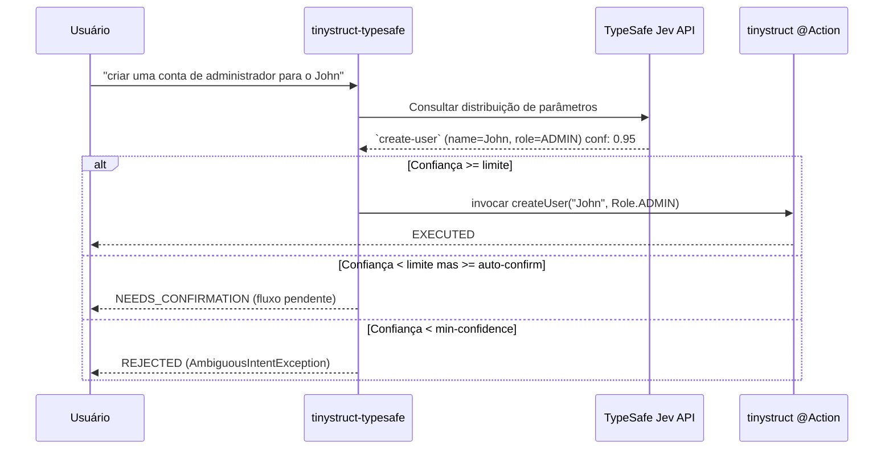

Language: [English](../README.md) | [Português (Brasil)](README.pt-BR.md) | [简体中文](README.zh-CN.md) | [繁體中文](README.zh-TW.md) | [日本語](README.ja.md) | [한국어](README.ko.md) | [Türkçe](README.tr.md) | [Русский](README.ru.md) | [Tiếng Việt](README.vi.md) | [ไทย](README.th.md) | [Deutsch](README.de.md) | [Español](README.es.md)

# tinystruct-typesafe

[](https://mvnrepository.com/artifact/org.tinystruct/tinystruct-typesafe-core)

> "O código é o dono do fluxo de trabalho; o modelo fornece o senso comum programável."

O **tinystruct-typesafe** permite que a linguagem natural invoque métodos `@Action` existentes do tinystruct, usando o **TypeSafe Jev** como um despachante semântico.

> [!IMPORTANT]
> Este **não** é um chatbot. Não há API de prompt nem abstração de chat. O Jev responde a perguntas retornando uma distribuição de probabilidade sobre as opções que você fornece. Ele nunca gera textos ou valores inventados; cada argumento que a ação recebe é uma constante enum, um booleano ou um trecho exato da entrada do usuário.

```bash
bin/dispatcher semantic --input "criar uma conta de administrador para o John"
# → create-user, name = John, role = ADMIN   (confiança 0.95)   → EXECUTED
```

---

## Índice
- [Fluxo de Arquitetura](#fluxo-de-arquitetura)
- [Módulos](#módulos)
- [Requisitos](#requisitos)
- [Tornando uma ação roteável](#tornando-uma-ação-roteável)
- [Configuração](#configuração)
- [Executando](#executando)
- [Segurança](#segurança)
- [Dados em Repouso](#dados-em-repouso)
- [Criando Seu Próprio Projeto](#criando-seu-próprio-projeto)
- [Construindo](#construindo)

---

## Fluxo de Arquitetura



---

## Módulos

| Módulo | Objetivo |
|---|---|
| `tinystruct-typesafe-client` | `TypesafeClient` em `POST /v1/systemone`, `RoutingRequest`/`RoutingResult`, `MockTypesafeClient` |
| `tinystruct-typesafe-core` | Pipeline de despacho, geração de perguntas, políticas, cache, métricas, ações `semantic` |
| `tinystruct-typesafe-workflow` | `ConfirmationService` no `tinystruct-workflow`: uma chamada pendente é uma execução de fluxo suspensa e persistida |
| `tinystruct-typesafe-demo` | Exemplos de aplicações: gerenciamento de usuários, CRM e help desk |

> [!NOTE]
> O `core` não depende do `tinystruct-workflow`. Sem o módulo de workflow, uma ação que precisa de confirmação é recusada em vez de executada.

---

## Requisitos

* Java 17
* **tinystruct 1.7.34 ou superior.** Este projeto depende de uma pequena mudança no framework (veja [Architecture.md](Architecture.md#the-tinystruct-change)): os metadados `@Action(arguments = ...)` agora mantêm a ordem, o `optional` e o tipo Java do parâmetro, e argumentos de texto são convertidos para `Set`/`List` de enums. 
* Uma chave de API do TypeSafe.

> [!TIP]
> Se o `tinystruct 1.7.34` ainda não estiver no Maven Central, você pode instalá-lo localmente clonando o repositório do `tinystruct` e rodando `mvn install`.

---

## Tornando uma ação roteável

Uma ação torna-se roteável quando está na lista de permissões (allowlist) **e** cada parâmetro é declarado em `@Action(arguments = ...)`:

```java
@Action(value = "create-user",
        description = "Cria uma nova conta de usuário com nome e cargo.",
        arguments = {
            @Argument(key = "name", description = "O nome do usuário."),
            @Argument(key = "role", description = "O cargo: ADMIN, EDITOR ou VIEWER.")
        })
public String createUser(String name, Role role) { ... }
```

> [!TIP]
> A descrição é o que o modelo lê, portanto, escreva para o modelo: **diga o que a ação faz, e o que ela não faz.**

### Como os Parâmetros são Solicitados

| Tipo do Parâmetro | Solicitado como |
|---|---|
| `enum` | uma pergunta do tipo `choice` sobre as constantes |
| `boolean` | uma pergunta do tipo `noul` |
| `Set<Enum>` / `List<Enum>` | uma pergunta `noul` por constante |
| `String`, números, `Date` | um `choice` sobre trechos da entrada original, com a opção "não declarado" |

### ⚠️ Coisas Importantes a Saber:

* **Argumentos vinculam por posição** (regra do tinystruct), logo um parâmetro só pode ser omitido no final. Um parâmetro opcional seguido por um fornecido é recusado.
* Valores não podem conter `/`, pois o tinystruct associa os argumentos a partir de segmentos da URL.
* Sobrecargas de uma mesma ação na lista de permissões não são suportadas.
* Templates de rota (`user/{id}`) e ações nativas (`start`, `generate`, ...) nunca são roteáveis.
* Uma ação declarada para um modo (`HTTP_POST`, `CLI`, ...) só é roteável naquele modo.

---

## Configuração

Configure a aplicação usando o `application.properties`:

| Chave | Padrão | Descrição |
|---|---|---|
| `typesafe.api-key` | env `TYPESAFE_API_KEY` | **Requerido.** Sua chave da API TypeSafe. |
| `typesafe.model` | `jev-latest` | Fixar uma versão (`jev-1.13.0`) em produção. |
| `typesafe.endpoint` | `https://api.typesafe.ai/v1/systemone` | O endpoint da API do TypeSafe Jev. |
| `typesafe.routing.allowed-actions` | *vazio* | **Separados por vírgula; nada é roteável até ser definido.** |
| `typesafe.routing.confirm-actions` | *vazio* | Sempre aguardar um humano, ex. `delete-user`. |
| `typesafe.routing.min-confidence` | `0.80` | Abaixo desta pontuação, a chamada é recusada (`AmbiguousIntentException`). |
| `typesafe.routing.min-confidence.<action>` | | Confiança mínima por ação. |
| `typesafe.routing.auto-confidence` | *desativado* | Do mínimo até este valor, pedirá confirmação. |
| `typesafe.routing.set-threshold` | `0.5` | Um membro do conjunto é incluído se a probabilidade for igual ou superior a esta. |
| `typesafe.routing.strategy` | `single` | `two-stage` envia a pergunta da ação primeiro, depois os argumentos. |
| `typesafe.routing.confirmation-timeout-seconds` | `300` | Tempo limite antes de uma confirmação expirar. |
| `typesafe.validation.max-argument-length` | `200` | Limite de caracteres para argumentos. |
| `typesafe.cache.provider` | `memory` | Tipo de cache: `none`, `memory`, `redis`. |
| `typesafe.cache.ttl` | `3600` | Tempo de vida (TTL) do cache em segundos. |
| `typesafe.confirmation.service` | *nenhum* | Nome da classe, ex. `org.tinystruct.typesafe.workflow.WorkflowConfirmationService`. |
| `typesafe.principal.resolver` | embutido | Nome da classe de um `PrincipalResolver` customizado. |
| `typesafe.workflow.repository` | `memory` | Tipo de armazenamento: `memory` (testes), `file`, `redis`, `database`. |
| `typesafe.workflow.snapshot-dir` | `workflow-snapshots/` | Diretório para o repositório `file`. |
| `typesafe.workflow.keep-completed` | `false` | Manter snapshots concluídos para auditoria. |
| `typesafe.logging.log-arguments` | `false` | Definir como true para registrar valores (pode expor dados sensíveis). |
| timeouts/retries | `5000, 30000, 3, 1000` | Limites para fallback de retentativas HTTP 429 e 529. |

> [!NOTE]
> Configurações do Redis seguem os próprios parâmetros do tinystruct: `redis.host`, `redis.port`, `redis.password`.

---

## Executando

Tudo roda através do `bin/dispatcher`; não há um método `main()`. O módulo de demonstração é o módulo executável:

```bash
# Constrói tudo e copia os jars do demo para tinystruct-typesafe-demo/lib
mvn package                                   

# Exportar a chave de API (ou definir typesafe.api-key no application.properties)
export TYPESAFE_API_KEY=...                   

cd tinystruct-typesafe-demo

# Windows: bin\dispatcher.cmd
bin/dispatcher semantic --input "criar uma conta de administrador para o John"      
```

> [!WARNING]
> O `bin/dispatcher` adiciona apenas o `target/classes`, o `lib/*.jar` e o jar do tinystruct ao classpath, então **todos os módulos que as aplicações usam devem estar em `lib/`**. É isso que o `mvn package` faz no demo. Rodar um lançador no `core/` ou `workflow/` falhará com `NoClassDefFoundError`, pois os módulos irmãos não estão no seu classpath.

### Comandos de CLI

| Comando | Ação |
|---|---|
| `semantic --input "..."` | Executa o pipeline. JSON resultante: `status` é `EXECUTED`, `NEEDS_CONFIRMATION` (com `pendingId`) ou `REJECTED` (com `reason`). |
| `semantic/confirm/<pendingId>` | Confirma uma chamada em espera. |
| `semantic/reject/<pendingId>` | Cancela uma chamada em espera. |
| `typesafe/metrics` | Retorna métricas do sistema em JSON. |

> [!IMPORTANT]
> Cada chamada do `bin/dispatcher` cria a sua própria JVM, logo os comandos de CLI exigem que o `typesafe.workflow.repository` seja configurado como `file` (ou `redis`/`database`). Usar `memory` não consegue transferir a chamada pendente para o próximo comando.

---

## Segurança

1. **Allowlist opt-in.** Apenas ações listadas nas permissões são oferecidas ao modelo ou roteáveis. O padrão é vazio.
2. **Os valores vêm da entrada.** Um argumento de texto livre é sempre um dos trechos originais do usuário. O modelo nunca escreve um argumento de forma independente.
3. **Validação.** Todo argumento resolvido é verificado de novo (presença, inclusão na enum, tipo, limite, caracteres) antes de rodar, e verificado de novo quando confirmado.
4. **Confiança.** Abaixo do mínimo, nada executa. A pontuação é o elo mais fraco de toda a avaliação da intenção do usuário.
5. **Confirmação, failing closed.** Ações de confirmação aguardam a validação humana. Se o `ConfirmationService` não existir, a chamada é abortada.
6. **Confirmar e rejeitar são autorizações.** Exigem a mesma entidade autenticada (JWT, usuário da sessão, etc) que iniciou a chamada. O input jamais confia em parâmetros fornecidos.
7. **Modo e segurança de caminho.** O framework garante o modo HTTP e CLI rigidamente isolado para ações.
8. **Contenção de Injeção.** Jev não impede as injeções nos prompts diretamente, mas reduz drásticamente o risco: as instruções injetadas só podem no máximo resolver ações *existentes na lista de permissão*, e qualquer intenção destrutiva irá passar pela aprovação humana (Workflow).

---

## Dados em Repouso

O snapshot de uma chamada pendente segura seus argumentos. Ele é excluído assim que a chamada é confirmada, rejeitada, expira ou falha (a não ser que `keep-completed=true`). As chamadas abandonadas permanecem até limpeza. 

> [!CAUTION]
> Restrinja o acesso ao diretório do snapshot (`file`) e use criptografia em disco.

---

## Criando Seu Próprio Projeto

Para integrar o **tinystruct-typesafe** no seu aplicativo:

1. **Adicionar as Dependências**
   Adicione ao seu `pom.xml` (e inclua o `tinystruct-typesafe-workflow` caso precise da confirmação humana):
   ```xml
   <dependencies>
       <dependency>
           <groupId>org.tinystruct</groupId>
           <artifactId>tinystruct</artifactId>
           <version>1.7.34</version>
       </dependency>
       <dependency>
           <groupId>org.tinystruct</groupId>
           <artifactId>tinystruct-typesafe-core</artifactId>
           <version>1.0.0</version>
       </dependency>
   </dependencies>
   ```

2. **Configurar application.properties**
   Crie um arquivo no `src/main/resources` e declare sua API key e lista de permissões:
   ```properties
   typesafe.api-key=SUA_API_KEY
   typesafe.routing.allowed-actions=create-user
   default.import.applications=com.example.MyApp
   ```

3. **Definir Ações Roteáveis**
   Crie a classe `Application` tradicional do tinystruct declarando todos os parâmetros:
   ```java
   import org.tinystruct.AbstractApplication;
   import org.tinystruct.system.annotation.Action;
   import org.tinystruct.system.annotation.Argument;

   public class MyApp extends AbstractApplication {
       @Override
       public void init() {
           this.setAction("create-user", "createUser");
       }
       
       @Action(value = "create-user", description = "Criação de usuário",
               arguments = { @Argument(key = "name", description = "Nome") })
       public String createUser(String name) {
           return "Criado: " + name;
       }
       
       @Override
       public String version() { return "1.0"; }
   }
   ```

4. **Rodar via Dispatcher**
   Execute o `bin/dispatcher` (ou `bin/dispatcher.cmd`) para enviar comandos em texto natural:
   ```bash
   bin/dispatcher semantic --input "Por favor crie a conta da Alice"
   ```

---

## Construindo

```bash
mvn verify
```

Irá rodar todos os testes de todas as pontas forçando os 90% de code-coverage. Testes utilizam componentes nativos do tinystruct.

### Mais Detalhes
Veja [Architecture.md](Architecture.md) e [DeveloperGuide.md](DeveloperGuide.md).
