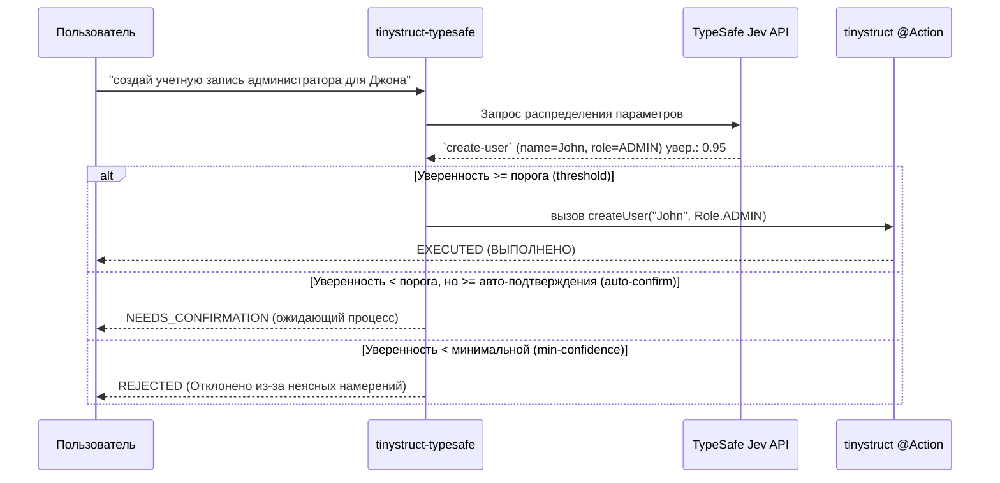

Language: [English](../README.md) | [Português (Brasil)](README.pt-BR.md) | [简体中文](README.zh-CN.md) | [繁體中文](README.zh-TW.md) | [日本語](README.ja.md) | [한국어](README.ko.md) | [Türkçe](README.tr.md) | [Русский](README.ru.md) | [Tiếng Việt](README.vi.md) | [ไทย](README.th.md) | [Deutsch](README.de.md) | [Español](README.es.md)

# tinystruct-typesafe

[](https://mvnrepository.com/artifact/org.tinystruct/tinystruct-typesafe-core)

> "Код управляет рабочим процессом; модель обеспечивает программируемый здравый смысл."

**tinystruct-typesafe** позволяет использовать естественный язык для вызова существующих методов `@Action` из tinystruct, применяя **TypeSafe Jev** в качестве семантического диспетчера.

> [!IMPORTANT]
> Это **не** чат-бот. Здесь нет API для промптов и нет абстракции чата. Jev отвечает на структурированные вводы, возвращая распределение вероятностей по вариантам, которые вы предоставляете. Он никогда не генерирует текст или значения из воздуха, поэтому каждый аргумент, который получает действие (Action), является либо константой перечисления (enum), либо логическим значением (boolean), либо дословным фрагментом из собственного ввода пользователя.

```bash
bin/dispatcher semantic --input "создай учетную запись администратора для Джона"
# → create-user, name = John, role = ADMIN   (уверенность 0.95)   → EXECUTED
```

---

## Оглавление
- [Архитектурный процесс](#архитектурный-процесс)
- [Модули](#модули)
- [Требования](#требования)
- [Как сделать действие маршрутизируемым](#как-сделать-действие-маршрутизируемым)
- [Конфигурация](#конфигурация)
- [Запуск](#запуск)
- [Безопасность](#безопасность)
- [Данные в состоянии покоя](#данные-в-состоянии-покоя)
- [Создание собственного проекта](#создание-собственного-проекта)
- [Сборка](#сборка)

---

## Архитектурный процесс



---

## Модули

| Модуль | Назначение |
|---|---|
| `tinystruct-typesafe-client` | `TypesafeClient` через `POST /v1/systemone`, `RoutingRequest`/`RoutingResult`, `MockTypesafeClient` |
| `tinystruct-typesafe-core` | Конвейер диспетчеризации, генерация вопросов, политики, кэш, метрики, базовые действия `semantic` |
| `tinystruct-typesafe-workflow` | `ConfirmationService` поверх `tinystruct-workflow`: ожидающий вызов выполняется как приостановленный и сохраненный рабочий процесс (workflow). |
| `tinystruct-typesafe-demo` | Примеры приложений: управление пользователями, CRM и служба поддержки |

> [!NOTE]
> `core` не зависит от `tinystruct-workflow`. Без модуля рабочего процесса (workflow) действие, требующее подтверждения, будет просто отклонено, а не приостановлено.

---

## Требования

* Java 17
* **tinystruct 1.7.34 или новее.** Этот проект опирается на небольшое изменение фреймворка (см. [Architecture.md](Architecture.md#the-tinystruct-change)): метаданные `@Action(arguments = ...)` теперь сохраняют порядок параметров, признак `optional` и тип Java, а строковые аргументы могут быть автоматически преобразованы в `Set`/`List` перечислений (enum).
* API-ключ TypeSafe.

> [!TIP]
> Если `tinystruct 1.7.34` еще не опубликован на Maven Central, вы можете установить его локально, клонировав репозиторий `tinystruct` и запустив `mvn install`.

---

## Как сделать действие маршрутизируемым

Действие становится маршрутизируемым, когда оно находится в белом списке (allowlist), **и** каждый параметр объявлен в `@Action(arguments = ...)`:

```java
@Action(value = "create-user",
        description = "Создает новую учетную запись пользователя с именем и ролью.",
        arguments = {
            @Argument(key = "name", description = "Имя пользователя."),
            @Argument(key = "role", description = "Роль: ADMIN, EDITOR или VIEWER.")
        })
public String createUser(String name, Role role) { ... }
```

> [!TIP]
> Описание (`description`) читает модель, поэтому пишите именно для неё: **четко укажите, что делает действие, а чего оно не делает.**

### Как задаются вопросы по параметрам

| Тип параметра | Как запрашивается |
|---|---|
| `enum` | один вопрос `choice` (выбор) по всем константам |
| `boolean` | один вопрос `noul` (да/нет) |
| `Set<Enum>` / `List<Enum>` | один вопрос `noul` (да/нет) на каждую константу |
| `String`, числа, `Date` | вопрос `choice` (выбор) по фрагментам ввода пользователя с опцией "не указано" |

### ⚠️ Важные моменты:

* **Аргументы привязываются по позиции** (внутреннее правило tinystruct). Поэтому параметр может быть опущен только в конце (предоставляя перегруженный метод с меньшим количеством параметров). Пропуск необязательного параметра перед обязательным приведет к ошибке.
* Значения не могут содержать `/`, потому что tinystruct привязывает аргументы из сегментов пути URL.
* Перегрузки методов для действий в белом списке не поддерживаются (фреймворк хранит только одно описание команды на одно имя).
* Шаблоны путей (`user/{id}`) и встроенные команды (`start`, `generate`, ...) никогда не маршрутизируются.
* Действие, объявленное для одного режима (например, `HTTP_POST`, `CLI`), может маршрутизироваться только в этом режиме.

---

## Конфигурация

Настройка приложения производится через `application.properties`:

| Ключ (Key) | По умолчанию | Описание |
|---|---|---|
| `typesafe.api-key` | перем. окр. `TYPESAFE_API_KEY` | **Обязательно.** Ваш API-ключ TypeSafe. |
| `typesafe.model` | `jev-latest` | В продакшене зафиксируйте версию (например, `jev-1.13.0`). |
| `typesafe.endpoint` | `https://api.typesafe.ai/v1/systemone` | Endpoint API TypeSafe Jev. |
| `typesafe.routing.allowed-actions` | *пусто* | **Разделяются запятыми; до настройки ничто не будет маршрутизироваться.** |
| `typesafe.routing.confirm-actions` | *пусто* | Действия, всегда ожидающие подтверждения человека (например, `delete-user`). |
| `typesafe.routing.min-confidence` | `0.80` | Вызов отклоняется, если оценка ниже этого значения (`AmbiguousIntentException`). |
| `typesafe.routing.min-confidence.<action>` | | Минимальная уверенность для конкретного действия. |
| `typesafe.routing.auto-confidence` | *откл* | От минимальной уверенности до этого значения запросы будут ожидающими подтверждения. |
| `typesafe.routing.set-threshold` | `0.5` | Элемент набора (Set) включается, если вероятность равна или выше этого значения. |
| `typesafe.routing.strategy` | `single` | Если `two-stage`, сначала запрашивается выбор действия, а затем его параметры. |
| `typesafe.routing.confirmation-timeout-seconds` | `300` | Таймаут (в сек.) до истечения срока ожидания подтверждения. |
| `typesafe.validation.max-argument-length` | `200` | Максимальная длина аргументов (символы). |
| `typesafe.cache.provider` | `memory` | Тип кэша: `none`, `memory`, `redis`. |
| `typesafe.cache.ttl` | `3600` | Время жизни кэша (в секундах). |
| `typesafe.confirmation.service` | *нет* | Имя класса, например `org.tinystruct.typesafe.workflow.WorkflowConfirmationService`. |
| `typesafe.principal.resolver` | встроенный | Имя класса пользовательского `PrincipalResolver`. |
| `typesafe.workflow.repository` | `memory` | Тип хранилища: `memory` (тесты), `file`, `redis`, `database`. |
| `typesafe.workflow.snapshot-dir` | `workflow-snapshots/` | Каталог для хранилища типа `file`. |
| `typesafe.workflow.keep-completed` | `false` | Сохранять завершенные снимки (снэпшоты) для аудита. |
| `typesafe.logging.log-arguments` | `false` | Если true, логирует значения (может раскрыть личные данные). |
| timeouts/retries | `5000, 30000, 3, 1000` | Лимиты и таймауты повторов для HTTP 429 и 529. |

> [!NOTE]
> Настройки Redis используют собственные параметры tinystruct: `redis.host`, `redis.port`, `redis.password`.

---

## Запуск

Всё работает через `bin/dispatcher`; метода `main()` нет. Демонстрационный модуль является исполняемым приложением:

```bash
# Собирает всё и копирует необходимые jar-файлы в tinystruct-typesafe-demo/lib
mvn package                                   

# Экспорт API-ключа (или настройте typesafe.api-key в application.properties)
export TYPESAFE_API_KEY=...                   

cd tinystruct-typesafe-demo

# В Windows: bin\dispatcher.cmd
bin/dispatcher semantic --input "создай учетную запись администратора для Джона"      
```

> [!WARNING]
> Скрипт `bin/dispatcher` добавляет в classpath только `target/classes`, `lib/*.jar` и сам jar tinystruct, поэтому **каждый модуль, который использует ваше приложение, должен находиться в `lib/`**. Именно это делает `mvn package` для демо. Запуск диспетчера напрямую из `core/` или `workflow/` не удастся (вызовет `NoClassDefFoundError`), так как соседние модули не попадут в classpath.

### Команды CLI

| Команда | Действие |
|---|---|
| `semantic --input "..."` | Запускает конвейер (pipeline). Результат в JSON: `status` может быть `EXECUTED`, `NEEDS_CONFIRMATION` (с `pendingId`) или `REJECTED` (с `reason`). |
| `semantic/confirm/<pendingId>` | Подтверждает и выполняет ожидающий вызов. |
| `semantic/reject/<pendingId>` | Отменяет ожидающий вызов. |
| `typesafe/metrics` | Возвращает системные метрики (счетчики) в формате JSON. |

> [!IMPORTANT]
> Каждый вызов `bin/dispatcher` запускает собственную JVM (поэтому `typesafe/metrics` учитывает только этот конкретный вызов), и для использования в командной строке требуется установить `typesafe.workflow.repository=file` (или `redis`/`database`); хранилище `memory` не сможет передать ожидающий вызов в следующую отдельную команду.

---

## Безопасность

1. **Белый список (Opt-in).** Только действия из белого списка предлагаются модели или маршрутизируются. По умолчанию он пуст.
2. **Значения берутся из ввода.** Любой текстовый аргумент всегда является фрагментом оригинального ввода пользователя. Модель никогда не генерирует собственные значения (это будет отклонено).
3. **Проверка (Validation).** Каждый разрешенный аргумент перед запуском проходит строгую проверку (присутствие, принадлежность к enum, тип данных, длина, управляющие символы, запрет на `/`), а затем проверяется повторно при подтверждении.
4. **Уверенность (Confidence).** Все, что ниже минимума, не выполняется. Оценка (score) — это самое слабое звено между выбором действия и всеми использованными аргументами.
5. **Подтверждение и безопасный отказ (Fail-close).** Действие, требующее подтверждения (или попадающее в зону авто-подтверждения), приостанавливается. Если `ConfirmationService` не настроен, вызов просто отклоняется.
6. **Подтверждение и отмена — это авторизация.** Они требуют того же принципала (субъекта), который инициировал вызов: проверенный субъект JWT, `userId` из сессии или сессия командной строки (`cli`). Параметры запроса никогда не используются как доверенный идентификатор.
7. **Безопасность режима и пути.** Фреймворк жестко обеспечивает режим работы каждого действия (HTTP, CLI), а диспетчер проверяет, что действие находится в белом списке.
8. **Ограничение инъекций (Injection).** Jev не обеспечивает особой защиты от внедрения в промпт (prompt injection). Однако вышеуказанные средства контроля сильно ограничивают ущерб: внедренная инструкция в худшем случае может лишь выбрать **другое действие из белого списка**, а деструктивные действия всё равно будут ожидать подтверждения человека.

---

## Данные в состоянии покоя

Снимок (snapshot) ожидающего вызова хранит его аргументы. Он удаляется, как только вызов подтвержден, отклонен, истек или завершился с ошибкой (если только не установлено `typesafe.workflow.keep-completed=true`). Вызовы, которые никто не трогал, остаются до тех пор, пока их не удалят.

> [!CAUTION]
> Ограничьте доступ к каталогу снимков (`file`) или хранилищу данных (`redis`, `database`) и шифруйте данные в состоянии покоя.

---

## Создание собственного проекта

Чтобы интегрировать **tinystruct-typesafe** в свое приложение:

1. **Добавьте зависимости (Dependencies)**
   Добавьте в свой `pom.xml` следующие строки (если вам нужно подтверждение с участием человека, добавьте также `tinystruct-typesafe-workflow`):
   ```xml
   <dependencies>
       <dependency>
           <groupId>org.tinystruct</groupId>
           <artifactId>tinystruct</artifactId>
           <version>1.7.34</version>
       </dependency>
       <dependency>
           <groupId>org.tinystruct</groupId>
           <artifactId>tinystruct-typesafe-core</artifactId>
           <version>1.0.0</version>
       </dependency>
   </dependencies>
   ```

2. **Настройте application.properties**
   Создайте файл `application.properties` в каталоге `src/main/resources` и укажите свой API-ключ и белый список:
   ```properties
   typesafe.api-key=ВАШ_API_КЛЮЧ
   typesafe.routing.allowed-actions=create-user
   default.import.applications=com.example.MyApp
   ```

3. **Определите маршрутизируемые действия (Actions)**
   Создайте стандартный класс `Application` и убедитесь, что в аннотациях `@Action` правильно объявлены метаданные аргументов:
   ```java
   import org.tinystruct.AbstractApplication;
   import org.tinystruct.system.annotation.Action;
   import org.tinystruct.system.annotation.Argument;

   public class MyApp extends AbstractApplication {
       @Override
       public void init() {
           this.setAction("create-user", "createUser");
       }
       
       @Action(value = "create-user", description = "Создает учетную запись",
               arguments = { @Argument(key = "name", description = "Имя пользователя") })
       public String createUser(String name) {
           return "Created " + name;
       }
       
       @Override
       public String version() { return "1.0"; }
   }
   ```

4. **Запуск через Dispatcher**
   Используйте скрипт `bin/dispatcher` (или `bin/dispatcher.cmd`) для отправки команд на естественном языке:
   ```bash
   bin/dispatcher semantic --input "Пожалуйста, создай пользователя по имени Алиса"
   ```

---

## Сборка

```bash
mvn verify
```

Команда запускает тесты всех четырех модулей и обеспечивает обязательное покрытие кода в 90% (Line Coverage) для `client`, `core` и `workflow`. В тестах используется реальный `ActionRegistry`, реальные действия и реальный движок рабочего процесса (workflow); имитируются (mock) только сетевые запросы к TypeSafe.

### Дополнительные материалы
Дополнительную информацию см. в [Architecture.md](Architecture.md) и [DeveloperGuide.md](DeveloperGuide.md).
