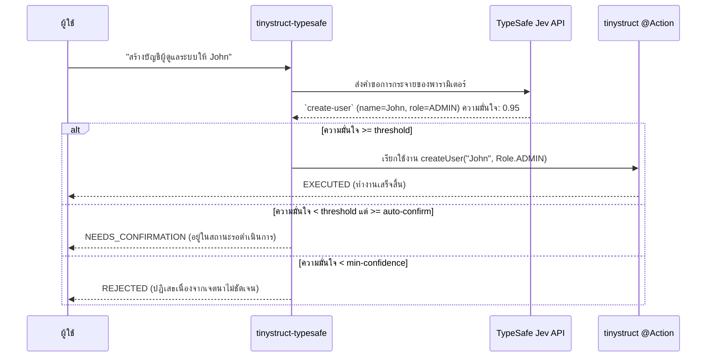

Language: [English](../README.md) | [Português (Brasil)](README.pt-BR.md) | [简体中文](README.zh-CN.md) | [繁體中文](README.zh-TW.md) | [日本語](README.ja.md) | [한국어](README.ko.md) | [Türkçe](README.tr.md) | [Русский](README.ru.md) | [Tiếng Việt](README.vi.md) | [ไทย](README.th.md) | [Deutsch](README.de.md) | [Español](README.es.md)

# tinystruct-typesafe

[](https://mvnrepository.com/artifact/org.tinystruct/tinystruct-typesafe-core)

> "โค้ดคือผู้ควบคุมเวิร์กโฟลว์; ส่วนโมเดลคือผู้มอบสามัญสำนึกที่สามารถตั้งโปรแกรมได้"

**tinystruct-typesafe** ช่วยให้คุณสามารถใช้ภาษาธรรมชาติในการเรียกใช้เมธอด `@Action` ที่มีอยู่ของ tinystruct ได้ โดยใช้ **TypeSafe Jev** เป็นตัวประมวลผลความหมาย (semantic dispatcher)

> [!IMPORTANT]
> นี่ **ไม่ใช่** แชทบอท ไม่มี Prompt API หรือระบบแชทซ่อนอยู่ Jev จะตอบสนองต่อข้อมูลที่ป้อนเข้ามาโดยการส่งคืนการกระจายความน่าจะเป็น (probability distribution) ไปยังตัวเลือกที่คุณตั้งไว้ มันไม่เคยสร้างข้อความหรือตัวเลขขึ้นมาเอง ดังนั้นอาร์กิวเมนต์ที่แต่ละ Action ได้รับจะเป็นค่าคงที่ของ enum, ค่า boolean หรือเป็นข้อความที่ตัดมาจากประโยคที่ผู้ใช้ป้อนเข้ามาตรงๆ เท่านั้น

```bash
bin/dispatcher semantic --input "สร้างบัญชีผู้ดูแลระบบให้ John"
# → create-user, name = John, role = ADMIN   (ความมั่นใจ 0.95)   → EXECUTED
```

---

## สารบัญ
- [การทำงานของสถาปัตยกรรม (Architecture Flow)](#การทำงานของสถาปัตยกรรม-architecture-flow)
- [โมดูลต่างๆ](#โมดูลต่างๆ)
- [ข้อกำหนด](#ข้อกำหนด)
- [การทำให้ Action สามารถเข้าถึงได้ (Routable)](#การทำให้-action-สามารถเข้าถึงได้-routable)
- [การตั้งค่า (Configuration)](#การตั้งค่า-configuration)
- [การรันแอปพลิเคชัน](#การรันแอปพลิเคชัน)
- [ความปลอดภัย](#ความปลอดภัย)
- [ข้อมูลที่ถูกจัดเก็บ (Data at rest)](#ข้อมูลที่ถูกจัดเก็บ-data-at-rest)
- [สร้างโปรเจกต์ของคุณเอง](#สร้างโปรเจกต์ของคุณเอง)
- [การบิวด์ (Building)](#การบิวด์-building)

---

## การทำงานของสถาปัตยกรรม (Architecture Flow)



---

## โมดูลต่างๆ

| โมดูล | วัตถุประสงค์ |
|---|---|
| `tinystruct-typesafe-client` | ระบบ `TypesafeClient` ผ่าน `POST /v1/systemone`, โครงสร้าง `RoutingRequest`/`RoutingResult`, และ `MockTypesafeClient` |
| `tinystruct-typesafe-core` | ระบบกระจายงานหลัก, การสร้างคำถาม, นโยบาย (policies), แคช, ระบบวัดผล (metrics), และแอ็กชัน `semantic` มาตรฐาน |
| `tinystruct-typesafe-workflow` | การใช้งาน `ConfirmationService` ที่ทำงานบน `tinystruct-workflow`: คำขอที่ถูกพักไว้จะถูกรันในรูปแบบของเวิร์กโฟลว์ที่ถูกพักการประมวลผลและเก็บบันทึกไว้ |
| `tinystruct-typesafe-demo` | แอปพลิเคชันตัวอย่าง: การจัดการผู้ใช้, CRM และระบบช่วยเหลือฝ่ายสนับสนุน (help desk) |

> [!NOTE]
> โมดูล `core` ไม่ได้ขึ้นอยู่กับ `tinystruct-workflow` หากไม่มีโมดูล workflow แอ็กชันที่จำเป็นต้องได้รับการยืนยันจากมนุษย์จะถูกปฏิเสธทันที แทนที่จะถูกพักรอไว้

---

## ข้อกำหนด

* Java 17
* **tinystruct 1.7.34 ขึ้นไป** โปรเจกต์นี้อ้างอิงการเปลี่ยนแปลงเล็กน้อยในตัวเฟรมเวิร์ก (ดูรายละเอียดใน [Architecture.md](Architecture.md#the-tinystruct-change)): ตอนนี้ `@Action(arguments = ...)` จะสามารถรักษาลำดับของพารามิเตอร์, ค่า `optional`, และชนิด Java type ของพารามิเตอร์นั้นไว้ได้ และพารามิเตอร์แบบ String จะถูกแปลงเป็น `Set`/`List` ของ Enum โดยอัตโนมัติ
* API Key จาก TypeSafe

> [!TIP]
> หาก `tinystruct 1.7.34` ยังไม่ได้ถูกพับลิชขึ้น Maven Central คุณสามารถติดตั้งในเครื่อง (local) ได้โดยการโคลนโปรเจกต์ `tinystruct` แล้วรัน `mvn install`

---

## การทำให้ Action สามารถเข้าถึงได้ (Routable)

Action หนึ่งๆ จะสามารถเข้าถึงได้เมื่อมันอยู่ในรายการที่อนุญาต (allowlist) **และ** ต้องประกาศพารามิเตอร์ทั้งหมดในรูปแบบ `@Action(arguments = ...)`:

```java
@Action(value = "create-user",
        description = "สร้างบัญชีผู้ใช้ใหม่ที่มีชื่อและบทบาท",
        arguments = {
            @Argument(key = "name", description = "ชื่อของผู้ใช้งาน"),
            @Argument(key = "role", description = "บทบาท: ADMIN, EDITOR หรือ VIEWER")
        })
public String createUser(String name, Role role) { ... }
```

> [!TIP]
> ส่วน `description` ถูกออกแบบมาให้ AI Model เป็นคนอ่าน ดังนั้นจงเขียนคำอธิบายนี้โดยคำนึงถึง Model: **จงบอกชัดเจนว่า Action นี้ทำอะไรได้บ้าง และอะไรที่ทำไม่ได้**

### รูปแบบคำถามสำหรับพารามิเตอร์

| ประเภทพารามิเตอร์ | จะถูกถามในรูปแบบ |
|---|---|
| `enum` | เป็นคำถามให้เลือกแบบ `choice` ที่แสดงตัวเลือกทั้งหมด |
| `boolean` | เป็นคำถามตอบ ใช่/ไม่ใช่ (`noul`) |
| `Set<Enum>` / `List<Enum>` | คำถาม ใช่/ไม่ใช่ (`noul`) ต่อตัวเลือก 1 ตัว |
| `String`, หมายเลข, `Date` | เป็นคำถามแบบเลือก (`choice`) โดยดึงส่วนใดส่วนหนึ่งมาจากข้อความที่ป้อนเข้ามา พร้อมมีตัวเลือก "ไม่ได้ระบุ" |

### ⚠️ สิ่งสำคัญที่ต้องรู้:

* **การแมปอาร์กิวเมนต์ยึดตามตำแหน่ง (position)** (ตามกฎปกติของ tinystruct) ดังนั้นพารามิเตอร์จะละเว้นได้เฉพาะที่อยู่ท้ายสุดเท่านั้น (โดยอาจสร้าง method overload ที่รับพารามิเตอร์น้อยกว่ามารองรับ) หากคุณละเว้นพารามิเตอร์ที่เป็น optional แล้วใส่ค่าถัดไปที่เป็นพารามิเตอร์บังคับ คำขอนั้นจะถูกปฏิเสธ
* ค่าภายในห้ามมีเครื่องหมาย `/` เด็ดขาด เพราะ tinystruct จะแยกอาร์กิวเมนต์จากโครงสร้างของ path
* การ Overload method สำหรับ Action ที่อยู่ใน allowlist จะไม่รองรับการทำงาน (เฟรมเวิร์กจะเก็บคำอธิบาย 1 อัน ต่อ 1 ชื่อคำสั่งเท่านั้น)
* Path templates (เช่น `user/{id}`) และคำสั่งพื้นฐาน (เช่น `start`, `generate`, ...) จะไม่มีทางถูกนำมารูทข้อมูลได้
* Action ที่ถูกประกาศโหมดเฉพาะ (เช่น `HTTP_POST`, `CLI`, ...) จะถูกรูทผ่านโหมดนั้นเท่านั้น

---

## การตั้งค่า (Configuration)

ทำการกำหนดค่าแอปพลิเคชันของคุณด้วยไฟล์ `application.properties`:

| คีย์ (Key) | ค่าเริ่มต้น | รายละเอียด |
|---|---|---|
| `typesafe.api-key` | ตัวแปรสิ่งแวดล้อม `TYPESAFE_API_KEY` | **บังคับ** API Key ของ TypeSafe |
| `typesafe.model` | `jev-latest` | โปรดปักหมุดเวอร์ชันที่แน่นอน (เช่น `jev-1.13.0`) เมื่อใช้ในระบบ production |
| `typesafe.endpoint` | `https://api.typesafe.ai/v1/systemone` | Endpoint API ของ TypeSafe Jev |
| `typesafe.routing.allowed-actions` | *ว่าง* | **แยกด้วยเครื่องหมายจุลภาค (,); หากไม่กำหนด จะไม่มีการรูทใดๆ** |
| `typesafe.routing.confirm-actions` | *ว่าง* | กำหนดให้รอการยืนยันจากมนุษย์เสมอ (เช่นคำสั่ง `delete-user`) |
| `typesafe.routing.min-confidence` | `0.80` | หากต่ำกว่าระดับนี้ คำขอจะถูกปฏิเสธทันที (`AmbiguousIntentException`) |
| `typesafe.routing.min-confidence.<action>` | | ตั้งค่าความมั่นใจขั้นต่ำเฉพาะสำหรับ Action นั้นๆ |
| `typesafe.routing.auto-confidence` | *ปิด* | ค่าระหว่างความมั่นใจขั้นต่ำกับค่านี้ จะต้องรอให้คนยืนยัน |
| `typesafe.routing.set-threshold` | `0.5` | ความเป็นไปได้ต้องมากกว่าหรือเท่ากับค่านี้ เพื่อดึงสมาชิกใส่ใน Set |
| `typesafe.routing.strategy` | `single` | โหมด `two-stage` จะส่งคำถามเกี่ยวกับ Action ก่อน จากนั้นค่อยตามด้วยพารามิเตอร์ |
| `typesafe.routing.confirmation-timeout-seconds` | `300` | เวลา (วินาที) ในการรอการยืนยันก่อนที่คำขอจะหมดอายุ |
| `typesafe.validation.max-argument-length` | `200` | จำนวนตัวอักษรสูงสุดของอาร์กิวเมนต์ |
| `typesafe.cache.provider` | `memory` | ชนิดของแคช: `none`, `memory`, `redis` |
| `typesafe.cache.ttl` | `3600` | อายุข้อมูลในแคชเป็นวินาที |
| `typesafe.confirmation.service` | *ไม่มี* | ใส่ชื่อคลาสที่เรียกใช้ ตัวอย่าง `org.tinystruct.typesafe.workflow.WorkflowConfirmationService` |
| `typesafe.principal.resolver` | ติดตั้งมาพร้อมระบบ | ใส่ชื่อคลาสสำหรับ `PrincipalResolver` ที่ตั้งค่าไว้แบบเฉพาะ |
| `typesafe.workflow.repository` | `memory` | ชนิดที่เก็บข้อมูล: `memory` (สำหรับเทสต์), `file`, `redis`, `database` |
| `typesafe.workflow.snapshot-dir` | `workflow-snapshots/` | ไดเรกทอรีสำหรับเก็บไฟล์ประเภท `file` |
| `typesafe.workflow.keep-completed` | `false` | ตั้งค่าเก็บ Snapshot ที่ทำเสร็จแล้วเพื่อการตรวจสอบ |
| `typesafe.logging.log-arguments` | `false` | ตั้งเป็น true หากต้องการบันทึกพารามิเตอร์ (อาจทำให้ข้อมูลส่วนบุคคลรั่วไหล) |
| timeouts/retries | `5000, 30000, 3, 1000` | การตั้งค่าจำกัดสำหรับรองรับ HTTP 429 และ 529 ในการลองทำงานใหม่ |

> [!NOTE]
> การตั้งค่า Redis จะเป็นไปตามพารามิเตอร์ของ tinystruct โดยอัตโนมัติ: `redis.host`, `redis.port`, `redis.password`

---

## การรันแอปพลิเคชัน

ทุกอย่างจะรันผ่าน `bin/dispatcher`; จะไม่มีเมธอด `main()` มาเกี่ยวข้อง ตัวโมดูลเดโมจะเป็นแอปพลิเคชันที่สามารถรันได้:

```bash
# คอมไพล์โปรเจกต์และก๊อบปี้ jar ที่จำเป็นสำหรับการรันของ demo ไปยังโฟลเดอร์ tinystruct-typesafe-demo/lib
mvn package                                   

# ทำการ Export ตัว API Key (หรือทำการกำหนด typesafe.api-key ไว้ใน application.properties ก็ได้)
export TYPESAFE_API_KEY=...                   

cd tinystruct-typesafe-demo

# สำหรับ Windows ให้ใช้: bin\dispatcher.cmd
bin/dispatcher semantic --input "สร้างบัญชีผู้ดูแลระบบให้ John"      
```

> [!WARNING]
> `bin/dispatcher` จะนำ `target/classes`, `lib/*.jar` และ tinystruct jar เก็บเข้าไปยัง classpath เท่านั้น ดังนั้น **ทุกโมดูลที่แอปพลิเคชันต้องการจะต้องอยู่ในโฟลเดอร์ `lib/`** นี่คือสิ่งที่ `mvn package` จัดเตรียมไว้ให้โมดูล demo การเรียกใช้ไฟล์เปิดโปรแกรมผ่านโฟลเดอร์ `core/` หรือ `workflow/` จะทำให้เกิดข้อผิดพลาด `NoClassDefFoundError` และล้มเหลวทันที เพราะโมดูลข้างเคียงเหล่านั้นไม่ได้ถูกบรรจุใน classpath

### คำสั่ง CLI (Command Line Interface)

| คำสั่ง | รูปแบบการทำงาน |
|---|---|
| `semantic --input "..."` | รันระบบ โดยผลลัพธ์จาก JSON คือ: `status` ซึ่งมีค่าเป็น `EXECUTED`, `NEEDS_CONFIRMATION` (มาพร้อม `pendingId`) หรือ `REJECTED` (มาพร้อม `reason`) |
| `semantic/confirm/<pendingId>` | อนุมัติการรอ และสั่งให้รันทำงาน |
| `semantic/reject/<pendingId>` | ยกเลิกการรอที่ค้างอยู่ |
| `typesafe/metrics` | สรุปผลเคาน์เตอร์ของระบบทั้งหมดในรูปแบบ JSON |

> [!IMPORTANT]
> การเรียกใช้ `bin/dispatcher` ในแต่ละครั้ง คือการสร้างรันของ JVM แยกกันอิสระ (ส่งผลให้ `typesafe/metrics` นับค่าเฉพาะในการเรียกใช้นั้นๆ) และในการใช้งานผ่านระบบ Command Line จำเป็นต้องตั้งค่า `typesafe.workflow.repository=file` (หรือ `redis`/`database`) เพราะการกำหนดแบบ `memory` ไม่สามารถทำให้สถานะการพักรอทำงาน ส่งต่อไปยังคำสั่งอื่นๆ ภายนอกได้

---

## ความปลอดภัย

1. **Allowlist แบบเจาะจง (Opt-in allowlist).** เฉพาะ Action ที่ได้รับอนุญาตเท่านั้นที่จะเข้าถึงโมเดลและรูทได้ ค่าเริ่มต้นจะเป็นค่าว่าง
2. **ข้อมูลทุกอย่างต้องมาจากผู้ใช้.** อาร์กิวเมนต์แบบ free-text ใดๆ ล้วนต้องตรงกับข้อความหนึ่งในประโยคที่ผู้ใช้ป้อนเข้ามา หากโมเดลจินตนาการค่าบางอย่างขึ้นมาเอง คำขอนั้นจะถูกปฏิเสธ โมเดลไม่เคยสร้างอาร์กิวเมนต์ของตัวมันเอง
3. **การประเมิน (Validation).** อาร์กิวเมนต์ที่ถูกระบุออกมาแล้วจะถูกทดสอบอย่างเข้มงวดก่อนเข้าสู่การรันเสมอ (เช่น ทดสอบความมีอยู่, ค่าภายใน enum, ชนิดข้อมูล, ขีดจำกัด, อักขระควบคุม, ข้อห้ามการใช้เครื่องหมาย `/`) และจะถูกนำมาทดสอบอีกครั้งหลังจากยืนยันคำขอ
4. **ความมั่นใจ (Confidence).** คำสั่งใดที่ความมั่นใจต่ำกว่าขีดจำกัดจะไม่มีวันถูกรัน คะแนนดังกล่าวมาจากปัจจัยที่อ่อนแอที่สุดระหว่างการจับคู่ของ Action และอาร์กิวเมนต์ที่เลือกมาทั้งหมด
5. **การยืนยันและการปิดเซฟ (Fail-close).** คำสั่งที่เป็น confirm-action หรืออยู่ในระดับที่ต้องรอยืนยันจะถูกพักรอ หากไม่ได้กำหนด `ConfirmationService` เอาไว้ คำสั่งเหล่านั้นจะถูกปฏิเสธโดยตรง และจะไม่มีวันถูกประมวลผล
6. **การอนุมัติและการยกเลิกคือสิทธิ์ (Authorization).** ระบบอนุญาตให้ผู้ที่ดำเนินการ 2 ส่วนนี้เป็นบุคคลเดียวกันกับตัวผู้ใช้งานดั้งเดิม (principal) ที่เริ่มคำขอเท่านั้น เช่น ผ่านการรองรับจาก JWT Subject, ไอดีในเซสชัน (`userId`), หรือ เซสชันระดับคอมมานด์ไลน์ (`cli`) ในเครื่องของระบบ พารามิเตอร์ภายใน request จะไม่มีทางนำมาอ้างตัวตนได้
7. **ความปลอดภัยของ Mode และ Path.** เฟรมเวิร์กมีการควบคุมโหมดของ Action แต่ละรูปแบบ (เช่น แยก HTTP และ CLI) และตัวจัดคิวจะทดสอบและตรวจสอบอีกชั้น ว่าคำสั่งนั้นอยู่ในรายชื่อ allowlist หรือไม่ ไม่ได้มองแค่รูปแบบอย่างเดียว
8. **ขีดจำกัดการโจมตี (Injection).** Jev ไม่ได้มีเกราะป้องกันพิเศษสำหรับ Prompt Injection แต่สิ่งที่จำกัดความเสียหายให้ตกอยู่ในสถานะที่ควบคุมได้ คือเกราะ 7 ข้อที่กล่าวไป การแทรกคำสั่งทำได้อย่างมากสุดแค่เลือก Action อื่น **ที่มีอยู่ใน allowlist** และทุก Action ที่สร้างความเสียหายจะถูกบังคับให้รอมนุษย์ยืนยันก่อนเสมอ

---

## ข้อมูลที่ถูกจัดเก็บ (Data at rest)

สแนปชอตที่บันทึกข้อมูลของคำสั่งที่รอดำเนินการ จะครอบครองพารามิเตอร์อาร์กิวเมนต์ทั้งหมดของคำขอนั้น มันจะถูกลบในทันทีที่คำขอนั้นถูกยอมรับ, ปฏิเสธ, หรือหมดเวลา (เว้นแต่จะตั้งค่า `typesafe.workflow.keep-completed=true`) ส่วนคำสั่งอื่นๆ ที่ไม่เคยถูกใครแตะต้อง จะยังคงค้างอยู่ในระบบ

> [!CAUTION]
> คุณควรจำกัดขอบเขตการเข้าถึงตัวเก็บข้อมูล (`file`, `redis`, `database`) และเข้ารหัส (encrypt) ปกป้องข้อมูลเหล่านี้ที่ถูกเก็บทิ้งไว้

---

## สร้างโปรเจกต์ของคุณเอง

หากต้องการติดตั้ง **tinystruct-typesafe** ในแอปพลิเคชันของคุณเอง:

1. **เพิ่ม Dependencies ที่จำเป็น**
   เพิ่มโค้ดด้านล่างนี้ลงในไฟล์ `pom.xml` ของโปรเจกต์ (หากต้องการใช้งาน Human-in-the-loop สามารถนำเข้า `tinystruct-typesafe-workflow` เพิ่มเติมได้):
   ```xml
   <dependencies>
       <dependency>
           <groupId>org.tinystruct</groupId>
           <artifactId>tinystruct</artifactId>
           <version>1.7.34</version>
       </dependency>
       <dependency>
           <groupId>org.tinystruct</groupId>
           <artifactId>tinystruct-typesafe-core</artifactId>
           <version>1.0.0</version>
       </dependency>
   </dependencies>
   ```

2. **ตั้งค่า application.properties**
   สร้างไฟล์ `application.properties` ในโฟลเดอร์ `src/main/resources` แล้วระบุ API Key พร้อมทั้ง Action ที่อนุญาตลงไป:
   ```properties
   typesafe.api-key=YOUR_API_KEY
   typesafe.routing.allowed-actions=create-user
   default.import.applications=com.example.MyApp
   ```

3. **เตรียมพร้อม Routable Actions**
   สร้างคลาส `Application` ทั่วไป และตรวจสอบว่าเมธอด `@Action` มีการประกาศอาร์กิวเมนต์อย่างถูกต้องแล้ว:
   ```java
   import org.tinystruct.AbstractApplication;
   import org.tinystruct.system.annotation.Action;
   import org.tinystruct.system.annotation.Argument;

   public class MyApp extends AbstractApplication {
       @Override
       public void init() {
           this.setTemplateRequired(false);
       }
       
       @Action(value = "create-user", description = "สร้างบัญชีผู้ใช้ใหม่",
               arguments = { @Argument(key = "name", description = "ชื่อของผู้ใช้") })
       public String createUser(String name) {
           return "Created " + name;
       }
       
       @Override
       public String version() { return "1.0"; }
   }
   ```

4. **รันผ่าน Dispatcher**
   เรียกใช้ `bin/dispatcher` (หรือ `bin/dispatcher.cmd`) เพือใช้ความสามารถในภาษาธรรมชาติแบบอัตโนมัติ:
   ```bash
   bin/dispatcher semantic --input "กรุณาสร้างบัญชีชื่อ Alice"
   ```

---

## การบิวด์ (Building)

```bash
mvn verify
```

คำสั่งนี้จะรัน unit test ของทั้งสี่โมดูล โดยตรวจสอบบังคับครอบคลุมโค้ด (Line Coverage) ขั้นต่ำ 90% ของ `client`, `core` และ `workflow` ภายในแบบทดสอบจะมีการใช้ทั้ง `ActionRegistry` ตัวจริง, Action ของจริง และ Engine เวริร์กโฟลว์ของจริง มีแค่ TypeSafe เท่านั้นที่ถูกจำลองการรับส่งเครือข่ายเอาไว้ (Mock)

### อ่านเพิ่มเติม
ศึกษาเพิ่มเติมเกี่ยวกับโครงสร้างและแนวทางการพัฒนาที่ [Architecture.md](Architecture.md) และ [DeveloperGuide.md](DeveloperGuide.md)
