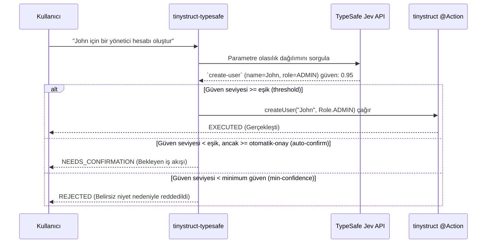

Language: [English](../README.md) | [Português (Brasil)](README.pt-BR.md) | [简体中文](README.zh-CN.md) | [繁體中文](README.zh-TW.md) | [日本語](README.ja.md) | [한국어](README.ko.md) | [Türkçe](README.tr.md) | [Русский](README.ru.md) | [Tiếng Việt](README.vi.md) | [ไทย](README.th.md) | [Deutsch](README.de.md) | [Español](README.es.md)

# tinystruct-typesafe

[](https://mvnrepository.com/artifact/org.tinystruct/tinystruct-typesafe-core)

> "Kod iş akışına sahip çıkar; model programlanabilir sağduyu sağlar."

**tinystruct-typesafe**, **TypeSafe Jev**'i anlamsal (semantic) bir yönlendirici olarak kullanarak doğal dil ile mevcut tinystruct `@Action` metotlarını çağırmanıza olanak tanır.

> [!IMPORTANT]
> Bu bir sohbet botu (chatbot) **değildir**. Bir prompt API'si veya sohbet soyutlaması yoktur. Jev, sağladığınız seçenekler üzerinde bir olasılık dağılımı döndürerek yapılandırılmış girdilere yanıt verir. Asla metin veya değer uydurmaz (halüsinasyon görmez), bu nedenle eylemin (Action) aldığı her argüman ya bir enum sabiti, ya bir boolean ya da kullanıcının kendi girdisinden alınan birebir bir parçadır.

```bash
bin/dispatcher semantic --input "John için bir yönetici hesabı oluştur"
# → create-user, name = John, role = ADMIN   (güven seviyesi 0.95)   → EXECUTED
```

---

## İçindekiler
- [Mimari Akış](#mimari-akış)
- [Modüller](#modüller)
- [Gereksinimler](#gereksinimler)
- [Bir Eylemi (Action) Yönlendirilebilir Yapmak](#bir-eylemi-action-yönlendirilebilir-yapmak)
- [Yapılandırma](#yapılandırma)
- [Çalıştırma](#çalıştırma)
- [Güvenlik](#güvenlik)
- [Bekleyen Veriler (Data at rest)](#bekleyen-veriler-data-at-rest)
- [Kendi Projenizi Oluşturma](#kendi-projenizi-oluşturma)
- [Derleme (Building)](#derleme-building)

---

## Mimari Akış



---

## Modüller

| Modül | Amaç |
|---|---|
| `tinystruct-typesafe-client` | `POST /v1/systemone` üzerinden `TypesafeClient`, `RoutingRequest`/`RoutingResult`, `MockTypesafeClient` |
| `tinystruct-typesafe-core` | Yönlendirme ardışık düzeni (pipeline), soru oluşturma, ilkeler, önbellek, metrikler, temel `semantic` eylemler |
| `tinystruct-typesafe-workflow` | `tinystruct-workflow` üzerinde `ConfirmationService`: Bekleyen bir çağrı, askıya alınmış ve kalıcı hale getirilmiş bir iş akışı olarak yürütülür. |
| `tinystruct-typesafe-demo` | Örnek uygulamalar: Kullanıcı yönetimi, CRM ve yardım masası. |

> [!NOTE]
> `core` modülü `tinystruct-workflow` modülüne bağımlı değildir. İş akışı (workflow) modülü olmadan, onay gerektiren bir eylem askıya alınmak yerine doğrudan reddedilir.

---

## Gereksinimler

* Java 17
* **tinystruct 1.7.34 veya üzeri.** Bu proje, framework üzerindeki küçük bir değişikliğe dayanır (Bkz. [Architecture.md](Architecture.md#the-tinystruct-change)): `@Action(arguments = ...)` metadatası artık argümanların sırasını, `optional` niteliğini ve argümanın Java tipini saklar. Ayrıca String argümanları otomatik olarak Enumların `Set`/`List` tipine dönüştürülür.
* TypeSafe API anahtarı.

> [!TIP]
> Eğer `tinystruct 1.7.34` henüz Maven Central'da yayınlanmadıysa, `tinystruct` deposunu klonlayın ve yerel olarak `mvn install` çalıştırarak kurulum yapın.

---

## Bir Eylemi (Action) Yönlendirilebilir Yapmak

Bir eylemin yönlendirilebilir (routable) olması için izin verilenler listesinde (allowlist) olması **ve** tüm parametrelerin `@Action(arguments = ...)` ile bildirilmiş olması gerekir:

```java
@Action(value = "create-user",
        description = "Adı ve rolü olan yeni bir kullanıcı hesabı oluşturur.",
        arguments = {
            @Argument(key = "name", description = "Kullanıcının adı."),
            @Argument(key = "role", description = "Rol: ADMIN, EDITOR veya VIEWER.")
        })
public String createUser(String name, Role role) { ... }
```

> [!TIP]
> `description` modeli beslemek içindir, bu yüzden modele yönelik yazın: **Eylemin ne yaptığını ve ne yapmadığını açıkça belirtin.**

### Parametreler Nasıl Sorulur?

| Parametre Tipi | Sorulma Şekli |
|---|---|
| `enum` | Tüm sabitleri içeren tek bir çoktan seçmeli (`choice`) soru |
| `boolean` | Tek bir evet/hayır (`noul`) sorusu |
| `Set<Enum>` / `List<Enum>` | Her bir sabit için bir evet/hayır (`noul`) sorusu |
| `String`, sayılar, `Date` | Girdi metninden spesifik bölümlerin sorulduğu, "belirtilmemiş" seçeneği de içeren çoktan seçmeli (`choice`) soru |

### ⚠️ Bilinmesi Gereken Önemli Şeyler:

* **Argümanlar konuma göre bağlanır** (tinystruct'ın kendi kuralı). Bu nedenle bir parametre, yalnızca parametre sayısının daha az olduğu bir aşırı yükleme (overload) metodu sağlanarak son kısımdan atlanabilir. İsteğe bağlı (optional) bir parametreyi atlayıp ardından zorunlu bir parametreyi verirseniz reddedilir.
* Değerler `/` içeremez, çünkü tinystruct argümanları URL yol (path) segmentlerinden bağlar.
* İzin listesindeki (allowlist) bir eylemin metod aşırı yüklemeleri (overload) desteklenmez (framework her isim için tek bir komut açıklaması tutar).
* Yol şablonları (`user/{id}`) ve yerleşik (built-in) komutlar (`start`, `generate` vb.) asla yönlendirilemez.
* Sadece belirli bir mod (`HTTP_POST`, `CLI` vb.) için bildirilen bir eylem, yalnızca o moddan yönlendirilebilir.

---

## Yapılandırma

Uygulamayı yapılandırmak için `application.properties` dosyasını kullanın:

| Anahtar (Key) | Varsayılan | Açıklama |
|---|---|---|
| `typesafe.api-key` | env `TYPESAFE_API_KEY` | **Gerekli.** TypeSafe API anahtarınız. |
| `typesafe.model` | `jev-latest` | Üretim (production) ortamında sürümü sabitleyin (ör. `jev-1.13.0`). |
| `typesafe.endpoint` | `https://api.typesafe.ai/v1/systemone` | TypeSafe Jev API'nin uç noktası (endpoint). |
| `typesafe.routing.allowed-actions` | *boş* | **Virgülle ayrılmış; ayarlanana kadar hiçbir şey yönlendirilemez.** |
| `typesafe.routing.confirm-actions` | *boş* | Her zaman bir insanın onayını bekleyecek eylemler (ör. `delete-user`). |
| `typesafe.routing.min-confidence` | `0.80` | Bu puanın altındaki çağrılar reddedilir (`AmbiguousIntentException`). |
| `typesafe.routing.min-confidence.<action>` | | Belirli eyleme özel minimum güven seviyesi. |
| `typesafe.routing.auto-confidence` | *kapalı* | Minimum güven ile bu değer arasındaki istekler onay için beklemeye alınır. |
| `typesafe.routing.set-threshold` | `0.5` | Olasılık bu eşik değerine eşit veya yüksekse Set üyeleri arasına dahil edilir. |
| `typesafe.routing.strategy` | `single` | `two-stage` seçilirse, önce eylemi sorar, ardından yalnızca o eylemin parametrelerini sorar. |
| `typesafe.routing.confirmation-timeout-seconds` | `300` | Bekleyen onay isteklerinin zaman aşımı süresi (saniye). |
| `typesafe.validation.max-argument-length` | `200` | Argümanların maksimum karakter uzunluğu. |
| `typesafe.cache.provider` | `memory` | Önbellek türü: `none`, `memory`, `redis`. |
| `typesafe.cache.ttl` | `3600` | Önbellekte kalma süresi (TTL) (saniye). |
| `typesafe.confirmation.service` | *yok* | Sınıf adı, ör. `org.tinystruct.typesafe.workflow.WorkflowConfirmationService`. |
| `typesafe.principal.resolver` | yerleşik | Özel bir `PrincipalResolver` sınıfının adı. |
| `typesafe.workflow.repository` | `memory` | Depolama türü: `memory` (testler için), `file`, `redis`, `database`. |
| `typesafe.workflow.snapshot-dir` | `workflow-snapshots/` | `file` deposu için klasör konumu. |
| `typesafe.workflow.keep-completed` | `false` | Denetim için tamamlanan anlık görüntüleri saklar. |
| `typesafe.logging.log-arguments` | `false` | True ayarlanırsa parametre değerlerini loglar (kişisel veriler açığa çıkabilir). |
| timeouts/retries | `5000, 30000, 3, 1000` | HTTP 429 ve 529 hataları için yeniden deneme kısıtlamaları. |

> [!NOTE]
> Redis ayarları tinystruct'ın kendi parametrelerini kullanır: `redis.host`, `redis.port`, `redis.password`.

---

## Çalıştırma

Her şey `bin/dispatcher` üzerinden yürütülür; `main()` metodu yoktur. Demo modülü, çalıştırılabilir olan uygulamadır:

```bash
# Her şeyi derler ve demonun çalışma zamanı jar dosyalarını tinystruct-typesafe-demo/lib dizinine kopyalar
mvn package                                   

# API anahtarını dışa aktar (veya application.properties içinde typesafe.api-key olarak ayarla)
export TYPESAFE_API_KEY=...                   

cd tinystruct-typesafe-demo

# Windows: bin\dispatcher.cmd
bin/dispatcher semantic --input "John için bir yönetici hesabı oluştur"      
```

> [!WARNING]
> `bin/dispatcher` yalnızca `target/classes`, `lib/*.jar` ve tinystruct jar dosyasını sınıf yoluna (classpath) ekler, bu yüzden **uygulamanın kullandığı tüm modüller `lib/` dizininde olmalıdır.** `mvn package` demo modülü için bunu yapar. Başlatıcıyı `core/` veya `workflow/` klasöründen çalıştırmak başarısız olur çünkü kardeş (sibling) modüller classpath içinde yer almayacaktır (`NoClassDefFoundError`).

### CLI Komutları

| Komut | Eylem |
|---|---|
| `semantic --input "..."` | Pipeline'ı çalıştırır. Sonuç JSON'unda `status`: `EXECUTED`, `NEEDS_CONFIRMATION` (`pendingId` içerir) veya `REJECTED` (`reason` içerir) döner. |
| `semantic/confirm/<pendingId>` | Bekleyen bir çağrıyı onaylayarak çalıştırır. |
| `semantic/reject/<pendingId>` | Bekleyen bir çağrıyı iptal eder. |
| `typesafe/metrics` | Sistem metriklerini (sayaçlar) JSON olarak döndürür. |

> [!IMPORTANT]
> `bin/dispatcher`'ın her bir çağrısı kendi bağımsız JVM'ine sahiptir (bu nedenle `typesafe/metrics` yalnızca o çağrıyı sayar). Komut satırı (CLI) kullanımında `typesafe.workflow.repository=file` (veya `redis`/`database`) ayarlanmış olması gerekir. `memory` ayarı, bekleyen çağrıyı bir sonraki ayrı komuta taşıyamaz.

---

## Güvenlik

1. **İsteğe bağlı izin listesi (Opt-in allowlist).** Yalnızca izin listesinde bulunan eylemler (Action) modele sunulur ve yönlendirilebilir olur. Varsayılan olarak boştur.
2. **Değerler girdiden gelir.** Serbest metin şeklindeki argümanlar her zaman kullanıcının orijinal metnindeki ifadelerden biri olmalıdır. Modelin kendi uydurduğu değerler reddedilir. Model asla kendi başına argüman yazmaz.
3. **Doğrulama (Validation).** Çözümlenen her argüman çalıştırılmadan önce tekrar kontrol edilir (varlık, enum üyeliği, veri türü, uzunluk, kontrol karakterleri ve `/` içermemesi) ve onaylandıktan sonra eylem çalışmadan önce bir kez daha kontrol edilir.
4. **Güven (Confidence).** Minimum güven seviyesinin altındaki istekler çalıştırılmaz. Puanlama; eylem seçimi ve kullanılan tüm argümanlar arasından en düşük güven puanını (en zayıf halkayı) esas alır.
5. **Onay ve Hata Koruması (Fail-close).** İnsan onayı bekleyen bir eylem veya otomatik onay aralığına giren çağrılar beklemeye alınır. `ConfirmationService` ayarlanmamışsa, çağrı reddedilir ve asla çalıştırılmaz.
6. **Onaylama ve reddetme aynı zamanda bir yetkilendirmedir (Authorization).** Bu işlemler, çağrıyı başlatan asıl kişi ile aynı principal (kimlik) yetkisi gerektirir: Doğrulanmış bir JWT subject'i, oturumdaki (session) `userId` veya komut satırındaki yerel oturum (`cli`). İstekte (request) gelen parametrelere asla bir kimlik belirtisi olarak güvenilmez.
7. **Mod ve yol (path) güvenliği.** Framework her eylemin çalışma modunu (HTTP, CLI vb.) zorunlu kılar. Dağıtıcı (dispatcher) sadece eşleşen paterni değil, eylemin izin listesinde olup olmadığını kontrol eder.
8. **Enjeksiyon kısıtlaması.** Jev, komut (prompt) enjeksiyonlarına özel bir direnç göstermez. Ancak, yukarıda sayılan kontroller olası zararları kısıtlar: Enjekte edilmiş bir komut en fazla **izin listesinde (allowlist) bulunan** farklı bir eylemi seçebilir ve zararlı veya kritik işlemler her zaman bir insanın onayını bekler.

---

## Bekleyen Veriler (Data at rest)

Bekleyen bir çağrının anlık görüntüsü (snapshot), argümanlarını tutar. Çağrı onaylanır onaylanmaz, reddedilirse, süresi dolarsa veya başarısız olursa silinir (`typesafe.workflow.keep-completed=true` yapılmadıkça). Kimsenin dokunmadığı sahipsiz çağrılar, temizlenene kadar sistemde kalır.

> [!CAUTION]
> Anlık görüntü (snapshot) dizinine (`file`) veya depolama birimine (`redis`, `database`) erişimi kısıtlayın ve bekleyen verileri (data at rest) şifreleyin.

---

## Kendi Projenizi Oluşturma

**tinystruct-typesafe**'i kendi uygulamanıza entegre etmek için:

1. **Bağımlılıkları (Dependencies) Ekleyin**
   Aşağıdaki satırları `pom.xml` dosyanıza ekleyin (İnsan onayı özelliği (human-in-the-loop) istiyorsanız isteğe bağlı olarak `tinystruct-typesafe-workflow`'u da dahil edebilirsiniz):
   ```xml
   <dependencies>
       <dependency>
           <groupId>org.tinystruct</groupId>
           <artifactId>tinystruct</artifactId>
           <version>1.7.34</version>
       </dependency>
       <dependency>
           <groupId>org.tinystruct</groupId>
           <artifactId>tinystruct-typesafe-core</artifactId>
           <version>1.0.0</version>
       </dependency>
   </dependencies>
   ```

2. **application.properties Yapılandırması**
   `src/main/resources` klasörü altında `application.properties` dosyası oluşturun ve API anahtarınız ile izin listenizi tanımlayın:
   ```properties
   typesafe.api-key=YOUR_API_KEY
   typesafe.routing.allowed-actions=create-user
   default.import.applications=com.example.MyApp
   ```

3. **Yönlendirilebilir Eylemleri (Actions) Tanımlama**
   Standart bir `Application` sınıfı oluşturun ve `@Action` metotlarınızın argüman metaverilerinin düzgün beyan edildiğinden emin olun:
   ```java
   import org.tinystruct.AbstractApplication;
   import org.tinystruct.system.annotation.Action;
   import org.tinystruct.system.annotation.Argument;

   public class MyApp extends AbstractApplication {
       @Override
       public void init() {
           this.setTemplateRequired(false);
       }
       
       @Action(value = "create-user", description = "Yeni bir kullanıcı oluşturur",
               arguments = { @Argument(key = "name", description = "Kullanıcının ismi") })
       public String createUser(String name) {
           return "Created " + name;
       }
       
       @Override
       public String version() { return "1.0"; }
   }
   ```

4. **Dispatcher ile Çalıştırma**
   Doğal dilde komutları yönlendirmek için `bin/dispatcher` (veya `bin/dispatcher.cmd`) komut dosyasını kullanın:
   ```bash
   bin/dispatcher semantic --input "Lütfen Alice adında bir kullanıcı oluştur"
   ```

---

## Derleme (Building)

```bash
mvn verify
```

Tüm dört modülün testlerini çalıştırır ve `client`, `core` ve `workflow` için %90 Satır Kapsama (Line Coverage) zorunluluğu uygular. Testlerde gerçek bir `ActionRegistry`, gerçek eylemler ve gerçek bir iş akışı motoru kullanılır; sadece TypeSafe istekleri (mock) olarak simüle edilir.

### Ek Kaynaklar
Daha fazla bilgi için [Architecture.md](Architecture.md) ve [DeveloperGuide.md](DeveloperGuide.md) dosyalarına göz atın.
