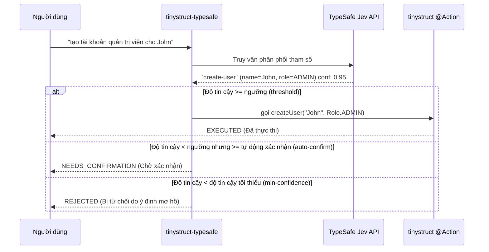

Language: [English](../README.md) | [Português (Brasil)](README.pt-BR.md) | [简体中文](README.zh-CN.md) | [繁體中文](README.zh-TW.md) | [日本語](README.ja.md) | [한국어](README.ko.md) | [Türkçe](README.tr.md) | [Русский](README.ru.md) | [Tiếng Việt](README.vi.md) | [ไทย](README.th.md) | [Deutsch](README.de.md) | [Español](README.es.md)

# tinystruct-typesafe

[](https://mvnrepository.com/artifact/org.tinystruct/tinystruct-typesafe-core)

> "Mã code kiểm soát quy trình làm việc; mô hình cung cấp cảm nhận thông thường (common sense) có thể lập trình."

**tinystruct-typesafe** cho phép sử dụng ngôn ngữ tự nhiên để gọi các phương thức `@Action` hiện có của tinystruct, bằng cách sử dụng **TypeSafe Jev** như một bộ định tuyến ngữ nghĩa (semantic dispatcher).

> [!IMPORTANT]
> Đây **không** phải là một chatbot. Không có API prompt và không có trừu tượng hóa chat. Jev trả lời các đầu vào bằng cách trả về phân phối xác suất dựa trên các tùy chọn bạn cung cấp. Nó không bao giờ tự tạo ra văn bản hay tự nghĩ ra giá trị, do đó, mỗi đối số mà Hành động (Action) nhận được đều là một hằng số enum, một boolean, hoặc một đoạn trích nguyên văn từ chính dữ liệu đầu vào của người dùng.

```bash
bin/dispatcher semantic --input "tạo tài khoản quản trị viên cho John"
# → create-user, name = John, role = ADMIN   (độ tin cậy 0.95)   → EXECUTED
```

---

## Mục lục
- [Luồng kiến trúc](#luồng-kiến-trúc)
- [Các mô-đun](#các-mô-đun)
- [Yêu cầu hệ thống](#yêu-cầu-hệ-thống)
- [Cách làm cho một Hành động có thể định tuyến](#cách-làm-cho-một-hành-động-có-thể-định-tuyến)
- [Cấu hình](#cấu-hình)
- [Hướng dẫn chạy](#hướng-dẫn-chạy)
- [Bảo mật](#bảo-mật)
- [Dữ liệu lưu trữ (Data at rest)](#dữ-liệu-lưu-trữ-data-at-rest)
- [Tạo dự án của riêng bạn](#tạo-dự-án-của-riêng-bạn)
- [Xây dựng (Building)](#xây-dựng-building)

---

## Luồng kiến trúc



---

## Các mô-đun

| Mô-đun | Mục đích |
|---|---|
| `tinystruct-typesafe-client` | `TypesafeClient` thông qua `POST /v1/systemone`, `RoutingRequest`/`RoutingResult`, `MockTypesafeClient` |
| `tinystruct-typesafe-core` | Quy trình phân phối (dispatch pipeline), tạo câu hỏi, chính sách, bộ nhớ đệm (cache), chỉ số (metrics), các hành động `semantic` cơ sở |
| `tinystruct-typesafe-workflow` | Triển khai `ConfirmationService` dựa trên `tinystruct-workflow`: Một cuộc gọi chờ xác nhận sẽ được thực thi như một quy trình làm việc (workflow) bị tạm dừng và lưu trữ. |
| `tinystruct-typesafe-demo` | Các ứng dụng mẫu: Quản lý người dùng, CRM và Help Desk. |

> [!NOTE]
> Mô-đun `core` không phụ thuộc vào `tinystruct-workflow`. Nếu không có mô-đun workflow, một hành động cần xác nhận sẽ trực tiếp bị từ chối thay vì bị tạm dừng.

---

## Yêu cầu hệ thống

* Java 17
* **tinystruct 1.7.34 hoặc mới hơn.** Dự án này phụ thuộc vào một thay đổi nhỏ của framework (xem [Architecture.md](Architecture.md#the-tinystruct-change)): Meta-data `@Action(arguments = ...)` hiện giữ lại thứ tự, thuộc tính `optional` và kiểu Java của tham số. Hơn nữa, tham số kiểu String được tự động chuyển đổi thành `Set`/`List` của Enum.
* Khóa API TypeSafe.

> [!TIP]
> Nếu `tinystruct 1.7.34` chưa có trên Maven Central, bạn có thể cài đặt cục bộ bằng cách clone kho lưu trữ `tinystruct` và chạy `mvn install`.

---

## Cách làm cho một Hành động có thể định tuyến

Hành động (Action) trở nên có thể định tuyến (routable) khi nó nằm trong danh sách cho phép (allowlist) **và** mọi tham số phải được khai báo trong `@Action(arguments = ...)`:

```java
@Action(value = "create-user",
        description = "Tạo một tài khoản người dùng mới với tên và vai trò.",
        arguments = {
            @Argument(key = "name", description = "Tên của người dùng."),
            @Argument(key = "role", description = "Vai trò: ADMIN, EDITOR hoặc VIEWER.")
        })
public String createUser(String name, Role role) { ... }
```

> [!TIP]
> Thuộc tính `description` (Mô tả) là thứ mà mô hình AI đọc, vì vậy hãy viết nó dành cho mô hình: **nêu rõ Hành động này làm gì, và không làm gì.**

### Tham số được hỏi như thế nào?

| Kiểu tham số | Cách đặt câu hỏi |
|---|---|
| `enum` | Một câu hỏi trắc nghiệm (`choice`) cho tất cả các hằng số |
| `boolean` | Một câu hỏi Có/Không (`noul`) |
| `Set<Enum>` / `List<Enum>` | Một câu hỏi Có/Không (`noul`) cho mỗi hằng số |
| `String`, số, `Date` | Một lựa chọn (`choice`) lấy từ các đoạn (span) của văn bản đầu vào, với một tùy chọn "không nêu rõ" |

### ⚠️ Những điều quan trọng cần biết:

* **Các đối số liên kết theo vị trí** (quy tắc riêng của tinystruct). Do đó, một tham số chỉ có thể được bỏ qua ở vị trí cuối cùng (bằng cách cung cấp một phương thức nạp chồng (overload) có ít tham số hơn). Nếu bỏ qua một tham số tùy chọn (optional) và sau đó cung cấp một tham số bắt buộc, yêu cầu sẽ bị từ chối.
* Giá trị không được chứa `/`, vì tinystruct phân tích các đối số từ các phân đoạn đường dẫn URL.
* Nạp chồng (overloads) cho một Hành động trong danh sách cho phép không được hỗ trợ (framework chỉ giữ một mô tả lệnh cho mỗi tên).
* Các mẫu đường dẫn (`user/{id}`) và các lệnh có sẵn (`start`, `generate`, ...) không bao giờ được định tuyến.
* Một Hành động được khai báo cho một chế độ cụ thể (`HTTP_POST`, `CLI`, ...) chỉ có thể được định tuyến trong chế độ đó.

---

## Cấu hình

Sử dụng `application.properties` để cấu hình ứng dụng:

| Khóa (Key) | Mặc định | Mô tả |
|---|---|---|
| `typesafe.api-key` | biến m.tr `TYPESAFE_API_KEY` | **Bắt buộc.** Khóa API TypeSafe của bạn. |
| `typesafe.model` | `jev-latest` | Cố định một phiên bản (vd: `jev-1.13.0`) trong môi trường production. |
| `typesafe.endpoint` | `https://api.typesafe.ai/v1/systemone` | Endpoint của API TypeSafe Jev. |
| `typesafe.routing.allowed-actions` | *rỗng* | **Phân tách bằng dấu phẩy; nếu không cấu hình thì không có gì được định tuyến.** |
| `typesafe.routing.confirm-actions` | *rỗng* | Các hành động luôn cần con người xác nhận (vd: `delete-user`). |
| `typesafe.routing.min-confidence` | `0.80` | Dưới điểm này, lệnh gọi sẽ bị từ chối (`AmbiguousIntentException`). |
| `typesafe.routing.min-confidence.<action>` | | Điểm tin cậy tối thiểu cho từng hành động cụ thể. |
| `typesafe.routing.auto-confidence` | *tắt* | Giữa mức tối thiểu và mức này, yêu cầu sẽ tạm dừng để chờ xác nhận. |
| `typesafe.routing.set-threshold` | `0.5` | Nếu xác suất bằng hoặc vượt mức này thì giá trị được đưa vào nhóm Set. |
| `typesafe.routing.strategy` | `single` | Nếu `two-stage`, mô hình sẽ hỏi hành động trước, sau đó mới hỏi tham số của hành động. |
| `typesafe.routing.confirmation-timeout-seconds` | `300` | Thời gian chờ (giây) trước khi yêu cầu xác nhận hết hạn. |
| `typesafe.validation.max-argument-length` | `200` | Chiều dài ký tự tối đa của đối số. |
| `typesafe.cache.provider` | `memory` | Loại bộ nhớ đệm: `none`, `memory`, `redis`. |
| `typesafe.cache.ttl` | `3600` | Thời gian tồn tại của cache (giây). |
| `typesafe.confirmation.service` | *không có* | Tên class, vd: `org.tinystruct.typesafe.workflow.WorkflowConfirmationService`. |
| `typesafe.principal.resolver` | có sẵn | Tên class của `PrincipalResolver` tùy chỉnh. |
| `typesafe.workflow.repository` | `memory` | Loại lưu trữ: `memory` (chỉ dùng cho test), `file`, `redis`, `database`. |
| `typesafe.workflow.snapshot-dir` | `workflow-snapshots/` | Thư mục lưu trữ khi dùng kho `file`. |
| `typesafe.workflow.keep-completed` | `false` | Có giữ lại snapshot hoàn thành cho mục đích kiểm toán hay không. |
| `typesafe.logging.log-arguments` | `false` | Nếu true, ghi log giá trị tham số (có thể làm lộ dữ liệu cá nhân). |
| timeouts/retries | `5000, 30000, 3, 1000` | Giới hạn thử lại (retry) khi gặp lỗi HTTP 429 và 529. |

> [!NOTE]
> Các thiết lập Redis tuân theo các tham số riêng của tinystruct: `redis.host`, `redis.port`, `redis.password`.

---

## Hướng dẫn chạy

Mọi thứ được chạy thông qua `bin/dispatcher`; không có phương thức `main()`. Mô-đun demo là ứng dụng có thể chạy được:

```bash
# Xây dựng mọi thứ và sao chép các tệp jar runtime của demo vào tinystruct-typesafe-demo/lib
mvn package                                   

# Xuất khóa API (hoặc cài đặt typesafe.api-key trong application.properties)
export TYPESAFE_API_KEY=...                   

cd tinystruct-typesafe-demo

# Windows: bin\dispatcher.cmd
bin/dispatcher semantic --input "tạo tài khoản quản trị viên cho John"      
```

> [!WARNING]
> `bin/dispatcher` chỉ thêm `target/classes`, `lib/*.jar` và jar của tinystruct vào classpath. Do đó, **tất cả các mô-đun mà ứng dụng sử dụng đều phải nằm trong thư mục `lib/`.** `mvn package` sẽ làm điều này cho thư mục demo. Việc chạy trực tiếp bộ khởi động từ thư mục `core/` hoặc `workflow/` sẽ thất bại và ném ra ngoại lệ `NoClassDefFoundError` vì các mô-đun anh em (sibling modules) không nằm trong classpath của nó.

### Các lệnh CLI (Dòng lệnh)

| Lệnh | Hành động |
|---|---|
| `semantic --input "..."` | Chạy luồng xử lý. Kết quả JSON trả về `status` có thể là: `EXECUTED`, `NEEDS_CONFIRMATION` (cùng `pendingId`) hoặc `REJECTED` (cùng `reason`). |
| `semantic/confirm/<pendingId>` | Xác nhận và thực thi một lệnh gọi bị tạm dừng. |
| `semantic/reject/<pendingId>` | Hủy một lệnh gọi bị tạm dừng. |
| `typesafe/metrics` | Trả về các chỉ số (counters) hệ thống dưới dạng JSON. |

> [!IMPORTANT]
> Mỗi lần gọi `bin/dispatcher` sẽ có một máy ảo Java (JVM) riêng (do đó `typesafe/metrics` chỉ đếm cho phiên đó) và đối với dòng lệnh thì bắt buộc phải cài `typesafe.workflow.repository=file` (hoặc `redis`/`database`); Thiết lập `memory` không thể mang cuộc gọi đang chờ sang lệnh tiếp theo.

---

## Bảo mật

1. **Danh sách cho phép (Opt-in allowlist).** Chỉ các hành động có trong danh sách cho phép mới được trình bày cho mô hình và có thể được định tuyến. Mặc định là trống.
2. **Giá trị đến từ đầu vào.** Bất kỳ đối số văn bản tự do nào cũng luôn là một phân đoạn (span) trong văn bản gốc của người dùng. Nếu mô hình tự bịa ra một giá trị thì nó sẽ bị từ chối. Mô hình không bao giờ tự viết đối số.
3. **Xác thực (Validation).** Mọi đối số sau khi phân giải đều được kiểm tra nghiêm ngặt trước khi chạy (sự hiện diện, thuộc enum, kiểu dữ liệu, độ dài, ký tự điều khiển, cấm chứa `/`) và kiểm tra lại một lần nữa khi xác nhận.
4. **Độ tin cậy (Confidence).** Bất kỳ lệnh nào có điểm tin cậy dưới mức tối thiểu sẽ không được chạy. Điểm số cuối cùng là mắt xích yếu nhất giữa sự lựa chọn Hành động và tất cả các đối số được sử dụng.
5. **Xác nhận và An toàn khép kín (Fail-close).** Một Hành động yêu cầu xác nhận, hoặc rơi vào vùng tự động xác nhận, sẽ bị tạm giữ. Nếu `ConfirmationService` chưa được định cấu hình, lệnh gọi sẽ trực tiếp bị từ chối và không bao giờ chạy.
6. **Xác nhận và Từ chối chính là Ủy quyền (Authorization).** Việc này yêu cầu cùng một danh tính (principal) như người đã bắt đầu lệnh: JWT Subject đã xác thực, `userId` của phiên web hoặc phiên cục bộ (`cli`). Các tham số của yêu cầu không bao giờ được tin tưởng như là mã định danh.
7. **Bảo mật Chế độ và Đường dẫn.** Framework bắt buộc chế độ môi trường (HTTP, CLI) cho từng hành động. Bộ phân phối (dispatcher) luôn kiểm tra đảm bảo lệnh gọi phân giải đúng hành động trong allowlist chứ không chỉ khớp theo mẫu (pattern).
8. **Hạn chế Tiêm chèn (Injection).** Jev không có cơ chế đặc biệt để chống lại Prompt Injection. Tuy nhiên, các rào cản ở trên đã hạn chế tối đa thiệt hại: Một lệnh được tiêm chèn tệ nhất cũng chỉ có thể chọn một hành động khác **nằm trong danh sách cho phép (allowlist)**; và các hành động nguy hiểm luôn chờ con người xác nhận.

---

## Dữ liệu lưu trữ (Data at rest)

Bản sao lưu (snapshot) của một lệnh gọi chờ sẽ lưu giữ các đối số của nó. Nó bị xóa ngay khi lệnh gọi được xác nhận, từ chối, hết hạn, hoặc thất bại (trừ khi đặt `typesafe.workflow.keep-completed=true`). Các lệnh gọi không ai động tới sẽ vẫn ở lại cho đến khi được xóa.

> [!CAUTION]
> Phải hạn chế quyền truy cập vào thư mục bản sao lưu (`file`) hoặc nơi lưu trữ dữ liệu (`redis`, `database`) và phải mã hóa dữ liệu lưu trữ tĩnh.

---

## Tạo dự án của riêng bạn

Để tích hợp **tinystruct-typesafe** vào ứng dụng riêng của bạn:

1. **Thêm các Phụ thuộc (Dependencies)**
   Thêm các dòng sau vào file `pom.xml` của bạn (bạn cũng có thể thêm tùy chọn `tinystruct-typesafe-workflow` nếu bạn cần chức năng xác nhận có sự tham gia của con người):
   ```xml
   <dependencies>
       <dependency>
           <groupId>org.tinystruct</groupId>
           <artifactId>tinystruct</artifactId>
           <version>1.7.34</version>
       </dependency>
       <dependency>
           <groupId>org.tinystruct</groupId>
           <artifactId>tinystruct-typesafe-core</artifactId>
           <version>1.0.0</version>
       </dependency>
   </dependencies>
   ```

2. **Cấu hình application.properties**
   Tạo tệp `application.properties` trong thư mục `src/main/resources` và khai báo khóa API cũng như danh sách cho phép (allowlist):
   ```properties
   typesafe.api-key=YOUR_API_KEY
   typesafe.routing.allowed-actions=create-user
   default.import.applications=com.example.MyApp
   ```

3. **Định nghĩa các Hành động có thể Định tuyến (Actions)**
   Tạo một lớp `Application` chuẩn và đảm bảo siêu dữ liệu (metadata) của đối số được khai báo đúng cách trên các phương thức `@Action`:
   ```java
   import org.tinystruct.AbstractApplication;
   import org.tinystruct.system.annotation.Action;
   import org.tinystruct.system.annotation.Argument;

   public class MyApp extends AbstractApplication {
       @Override
       public void init() {
           this.setAction("create-user", "createUser");
       }
       
       @Action(value = "create-user", description = "Tạo một tài khoản người dùng",
               arguments = { @Argument(key = "name", description = "Tên người dùng") })
       public String createUser(String name) {
           return "Created " + name;
       }
       
       @Override
       public String version() { return "1.0"; }
   }
   ```

4. **Chạy qua Dispatcher**
   Sử dụng tệp lệnh `bin/dispatcher` (hoặc `bin/dispatcher.cmd`) để định tuyến các lệnh ngôn ngữ tự nhiên:
   ```bash
   bin/dispatcher semantic --input "Xin hãy tạo một người dùng tên là Alice"
   ```

---

## Xây dựng (Building)

```bash
mvn verify
```

Lệnh này sẽ chạy các bài kiểm thử của cả 4 mô-đun và bắt buộc Đạt độ bao phủ Mã lệnh (Line Coverage) 90% trên `client`, `core` và `workflow`. Các bài test sử dụng `ActionRegistry` thật, các Action thật, và trình chạy workflow thật; chỉ duy nhất kết nối mạng tới TypeSafe là được giả lập (mock).

### Tài liệu tham khảo thêm
Xem [Architecture.md](Architecture.md) và [DeveloperGuide.md](DeveloperGuide.md).
