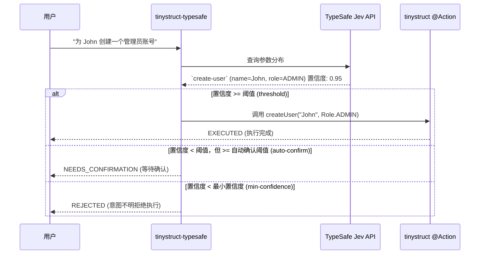

Language: [English](../README.md) | [Português (Brasil)](README.pt-BR.md) | [简体中文](README.zh-CN.md) | [繁體中文](README.zh-TW.md) | [日本語](README.ja.md) | [한국어](README.ko.md) | [Türkçe](README.tr.md) | [Русский](README.ru.md) | [Tiếng Việt](README.vi.md) | [ไทย](README.th.md) | [Deutsch](README.de.md) | [Español](README.es.md)

# tinystruct-typesafe

[](https://mvnrepository.com/artifact/org.tinystruct/tinystruct-typesafe-core)

> “代码掌控工作流，模型提供可编程常识。”

**tinystruct-typesafe** 利用 **TypeSafe Jev** 作为语义分发器，让你能够使用自然语言调用现有的 tinystruct `@Action` 方法。

> [!IMPORTANT]
> 这**不**是一个聊天机器人。这里没有提示词（prompt）API，也没有聊天抽象概念。Jev 通过返回你提供选项的概率分布来回答结构化输入。它永远不会生成或编造文本，因此该操作（Action）收到的每个参数要么是枚举常量，要么是布尔值，要么是完全来自用户输入的一段原文。

```bash
bin/dispatcher semantic --input "为 John 创建一个管理员账号"
# → create-user, name = John, role = ADMIN   (置信度 0.95)   → EXECUTED
```

---

## 目录
- [架构流程](#架构流程)
- [模块](#模块)
- [环境要求](#环境要求)
- [如何让动作（Action）支持路由](#如何让动作action支持路由)
- [配置说明](#配置说明)
- [运行指南](#运行指南)
- [安全机制](#安全机制)
- [数据留存](#数据留存)
- [创建你自己的项目](#创建你自己的项目)
- [构建](#构建)

---

## 架构流程



---

## 模块

| 模块名称 | 作用 |
|---|---|
| `tinystruct-typesafe-client` | 基于 `POST /v1/systemone` 的 `TypesafeClient`，以及 `RoutingRequest`/`RoutingResult` 和 `MockTypesafeClient`。 |
| `tinystruct-typesafe-core` | 分发核心、问题生成、策略管理、缓存、指标采集，以及提供基础 `semantic` 动作。 |
| `tinystruct-typesafe-workflow` | 为 `tinystruct-workflow` 实现的 `ConfirmationService`：每一个被挂起的调用都会作为一个挂起并被持久化的工作流执行。 |
| `tinystruct-typesafe-demo` | 示例应用：用户管理、CRM 及工单系统（help desk）。 |

> [!NOTE]
> `core` 模块不依赖 `tinystruct-workflow`。如果在没有集成 workflow 模块的情况下，一个需要确认的动作会直接被拒绝，而不是被挂起。

---

## 环境要求

* Java 17
* **tinystruct 1.7.34 或更高版本。** 该项目依赖于 tinystruct 框架的一个小更新（见 [Architecture.md](Architecture.md#the-tinystruct-change)）：现在 `@Action(arguments = ...)` 元数据保留了参数的顺序、`optional` 属性以及其 Java 类型，并且字符串参数可以自动转换为 `Set`/`List` 枚举。
* 一个 TypeSafe 的 API 密钥。

> [!TIP]
> 如果 `tinystruct 1.7.34` 尚未发布到 Maven Central，你可以通过克隆 `tinystruct` 源码并在本地运行 `mvn install` 来安装它。

---

## 如何让动作（Action）支持路由

要让一个动作支持语义路由，它必须位于**白名单（allowlist）**中，**并且**每个参数都必须声明在 `@Action(arguments = ...)` 里：

```java
@Action(value = "create-user",
        description = "创建一个包含姓名和角色的新用户账号。",
        arguments = {
            @Argument(key = "name", description = "用户的姓名。"),
            @Argument(key = "role", description = "角色：ADMIN、EDITOR 或 VIEWER。")
        })
public String createUser(String name, Role role) { ... }
```

> [!TIP]
> 这个 `description` 是写给模型看的，所以：**清楚说明这个动作能做什么，不能做什么。**

### 参数是如何被提问的

| 参数类型 | 对应的提问方式 |
|---|---|
| `enum` | 针对所有常量的单选题 (`choice`) |
| `boolean` | 一个是非题 (`noul`) |
| `Set<Enum>` / `List<Enum>` | 为每个常量分配一个是非题 (`noul`) |
| `String`, 数字, `Date` | 针对输入文本中具体片段的 `choice`，并提供一个“未说明”的选项 |

### ⚠️ 重要须知：

* **参数按位置绑定**（tinystruct 的自有规则），因此只有末尾的参数可以被省略（通过提供参数更少的重载方法）。提供必填参数后，漏填前面的必填项将导致请求被拒绝。
* 参数值中不得包含 `/`，因为 tinystruct 通过 URL 路径片段进行参数绑定。
* 处于白名单中的动作不支持方法重载（框架为每个名称只保留一个命令描述）。
* 路径模板 (`user/{id}`) 和内置命令 (`start`, `generate`, ...) 永远不会被路由。
* 一个仅在一种模式下（如 `HTTP_POST` 或 `CLI`）声明的动作，只能在该模式下被路由。

---

## 配置说明

使用 `application.properties` 来进行配置：

| 配置键 (Key) | 默认值 | 描述 |
|---|---|---|
| `typesafe.api-key` | env `TYPESAFE_API_KEY` | **必填。** 你的 TypeSafe API 密钥。 |
| `typesafe.model` | `jev-latest` | 在生产环境中请锁定版本（如 `jev-1.13.0`）。 |
| `typesafe.endpoint` | `https://api.typesafe.ai/v1/systemone` | TypeSafe Jev 的 API 端点。 |
| `typesafe.routing.allowed-actions` | *空* | **逗号分隔；在配置此项之前，任何请求都不可路由。** |
| `typesafe.routing.confirm-actions` | *空* | 这些动作永远需要人类确认（如 `delete-user`）。 |
| `typesafe.routing.min-confidence` | `0.80` | 置信度低于此分数时，请求会被直接拒绝（`AmbiguousIntentException`）。 |
| `typesafe.routing.min-confidence.<action>` | | 单独为某个动作设定最小置信度。 |
| `typesafe.routing.auto-confidence` | *关闭* | 介于最小置信度和此分数之间的请求将被挂起，需要人工确认。 |
| `typesafe.routing.set-threshold` | `0.5` | 当某项的概率达到或超过该阈值时，它将被包含在集合结果中。 |
| `typesafe.routing.strategy` | `single` | 如果为 `two-stage`，则先仅询问动作选择，再询问其参数。 |
| `typesafe.routing.confirmation-timeout-seconds` | `300` | 挂起的确认请求的超时秒数。 |
| `typesafe.validation.max-argument-length` | `200` | 参数值的最大字符长度。 |
| `typesafe.cache.provider` | `memory` | 缓存类型：`none`, `memory`, `redis`。 |
| `typesafe.cache.ttl` | `3600` | 缓存的存活时间（秒）。 |
| `typesafe.confirmation.service` | *空* | 自定义类的名称，如 `org.tinystruct.typesafe.workflow.WorkflowConfirmationService`。 |
| `typesafe.principal.resolver` | built-in | 自定义 `PrincipalResolver` 类的名称。 |
| `typesafe.workflow.repository` | `memory` | 存储类型：`memory` (仅用于测试), `file`, `redis`, `database`。 |
| `typesafe.workflow.snapshot-dir` | `workflow-snapshots/` | 使用 `file` 存储时的快照目录。 |
| `typesafe.workflow.keep-completed` | `false` | 设置为 true 则保留已完成的快照，用于审计。 |
| `typesafe.logging.log-arguments` | `false` | 设置为 true 时将记录参数值（这可能会暴露用户个人数据）。 |
| timeouts/retries | `5000, 30000, 3, 1000` | 应对 HTTP 429 和 529 的回退重试策略。 |

> [!NOTE]
> Redis 的相关配置遵循 tinystruct 的标准参数：`redis.host`, `redis.port`, `redis.password`。

---

## 运行指南

所有的应用都是通过 `bin/dispatcher` 运行的；没有 `main()` 方法。demo 模块就是可以运行的示例：

```bash
# 编译打包，并将相关的 runtime jars 复制到 tinystruct-typesafe-demo/lib 中
mvn package                                   

# 暴露你的 API 密钥 (或写在 application.properties 里)
export TYPESAFE_API_KEY=...                   

cd tinystruct-typesafe-demo

# Windows 下请使用: bin\dispatcher.cmd
bin/dispatcher semantic --input "为 John 创建一个管理员账号"      
```

> [!WARNING]
> `bin/dispatcher` 仅仅把 `target/classes`、`lib/*.jar` 以及 tinystruct 的 jar 放入了 classpath 中。因此，**你的应用程序所需要的所有模块都必须出现在 `lib/` 目录中。** 这就是 `mvn package` 对 demo 模块所做的事。如果你直接在 `core/` 或 `workflow/` 目录下运行启动脚本，将会抛出 `NoClassDefFoundError`，因为相关的兄弟模块并没有在它的 classpath 内。

### 常用 CLI 命令行指令

| 命令 | 行为 |
|---|---|
| `semantic --input "..."` | 执行语义流水线。返回的 JSON 中，`status` 可能为 `EXECUTED`、`NEEDS_CONFIRMATION` (附带 `pendingId`) 或 `REJECTED` (附带 `reason`)。 |
| `semantic/confirm/<pendingId>` | 确认并执行一个被挂起的调用。 |
| `semantic/reject/<pendingId>` | 撤销一个被挂起的调用。 |
| `typesafe/metrics` | 以 JSON 形式返回系统的性能指标（counters）。 |

> [!IMPORTANT]
> 每一次调用 `bin/dispatcher` 都会单独启动一个 JVM（因此 `typesafe/metrics` 的计数只统计本次运行），且在命令行下使用时，需要设置 `typesafe.workflow.repository=file`（或 `redis`/`database`）；因为 `memory` 无法将处于等待确认的请求传递给下一次单独运行的命令。

---

## 安全机制

1. **白名单模式（Opt-in）。** 只有在白名单（allowlist）内的动作才会被呈现给模型或被允许路由。默认情况下白名单为空。
2. **值来源于输入内容。** 任意的自由文本参数都必定是来源于用户原话的某个切片；如果模型自己凭空捏造出一个值，该请求会被拒绝执行。模型永远不负责自主编写任何参数。
3. **彻底验证。** 每个被解析出来的参数，在实际运行动作之前，都会经过严密校验（是否缺失、枚举成员合法性、数据类型、长度限制、控制字符、不能包含 `/`），并在确认后再进行一次校验。
4. **置信度保障。** 低于最小置信度的请求根本不会运行。最终分数是动作匹配度以及所有被使用的参数匹配度中最低的一环。
5. **需要确认并默认关闭。** 设定了人工确认的动作、或是落入自动确认阈值的请求，都会被挂起。如果没有正确配置 `ConfirmationService`，该请求将直接被拒绝，绝不会运行。
6. **确认与撤销也是授权。** `confirm` 或 `reject` 需要由发起该请求的同一合法身份来进行。无论是经过验证的 JWT subject、会话的 `userId`、还是本地命令行的特殊处理（`cli`）。系统不会信任用户提交的任何参数化身份标识。
7. **模式与路径的安全保障。** 框架严格保证动作被执行的环境（比如隔离 HTTP 和 CLI）。
8. **限制注入（Injection）。** Jev 并不会特别抵御那些试图在输入中塞入的控制指令。但这正是上述控制机制发挥作用的地方：即使发生了提示词注入，最坏的情况也仅仅是模型选中了另一个**处于白名单中**的无害动作；所有具有破坏性的动作都可以被配置为需要人类二次确认。

---

## 数据留存

被挂起的请求在快照（snapshot）中保存着所有的参数记录。一旦请求被确认执行、被拒绝、超时或者执行失败，这条快照就会被自动删除（除非你设置了 `typesafe.workflow.keep-completed=true`）。那些永远无人过问的请求则会一直保留。

> [!CAUTION]
> 必须限制访问快照目录 (`file`) 或者存储设施 (`redis`, `database`) 的权限，并对静止数据进行加密保护。

---

## 创建你自己的项目

如果你想在自己的应用程序中集成 **tinystruct-typesafe**：

1. **添加依赖 (Dependencies)**
   在你的 `pom.xml` 中引入如下配置 (如果你需要支持人工二次确认功能，也可以同时引入 `tinystruct-typesafe-workflow`)：
   ```xml
   <dependencies>
       <dependency>
           <groupId>org.tinystruct</groupId>
           <artifactId>tinystruct</artifactId>
           <version>1.7.34</version>
       </dependency>
       <dependency>
           <groupId>org.tinystruct</groupId>
           <artifactId>tinystruct-typesafe-core</artifactId>
           <version>1.0.0</version>
       </dependency>
   </dependencies>
   ```

2. **配置 application.properties**
   在 `src/main/resources` 目录下创建 `application.properties`，填入你的 API 密钥和白名单：
   ```properties
   typesafe.api-key=YOUR_API_KEY
   typesafe.routing.allowed-actions=create-user
   default.import.applications=com.example.MyApp
   ```

3. **定义可被路由的动作 (Actions)**
   创建一个标准的 `Application` 并在你的 `@Action` 方法上补充必要的参数元数据：
   ```java
   import org.tinystruct.AbstractApplication;
   import org.tinystruct.system.annotation.Action;
   import org.tinystruct.system.annotation.Argument;

   public class MyApp extends AbstractApplication {
       @Override
       public void init() {
           this.setAction("create-user", "createUser");
       }
       
       @Action(value = "create-user", description = "创建一个用户",
               arguments = { @Argument(key = "name", description = "用户的名字") })
       public String createUser(String name) {
           return "Created " + name;
       }
       
       @Override
       public String version() { return "1.0"; }
   }
   ```

4. **通过 Dispatcher 执行指令**
   通过命令行输入自然语言，程序会自动推断参数并执行你的代码：
   ```bash
   bin/dispatcher semantic --input "Please create a user named Alice"
   ```

---

## 构建

```bash
mvn verify
```

这将会运行所有四个模块的测试，并且强制要求 `client`, `core` 和 `workflow` 达到 90% 的行覆盖率（Line Coverage）。测试过程使用了真实的 `ActionRegistry`、真实的动作和真实的 workflow 引擎，仅仅是将 TypeSafe 的网络响应做了 Mock 处理。

### 拓展阅读
详见 [Architecture.md](Architecture.md) 以及 [DeveloperGuide.md](DeveloperGuide.md)。
