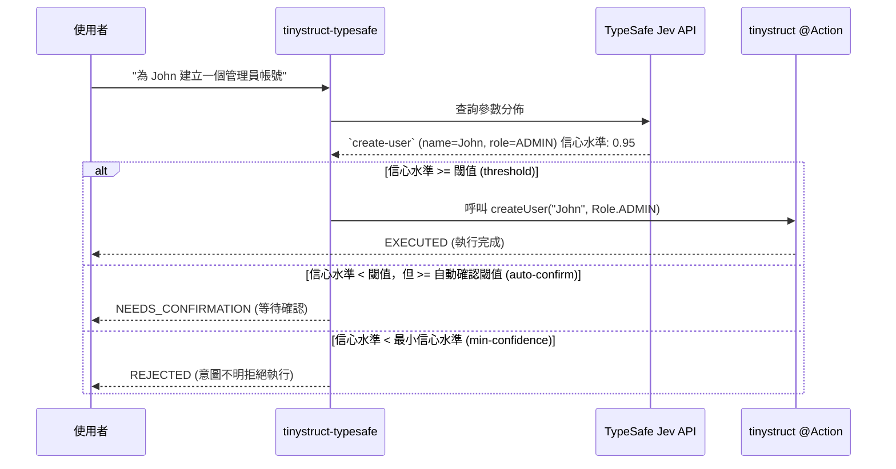

Language: [English](../README.md) | [Português (Brasil)](README.pt-BR.md) | [简体中文](README.zh-CN.md) | [繁體中文](README.zh-TW.md) | [日本語](README.ja.md) | [한국어](README.ko.md) | [Türkçe](README.tr.md) | [Русский](README.ru.md) | [Tiếng Việt](README.vi.md) | [ไทย](README.th.md) | [Deutsch](README.de.md) | [Español](README.es.md)

# tinystruct-typesafe

[](https://mvnrepository.com/artifact/org.tinystruct/tinystruct-typesafe-core)

> 「程式碼掌控工作流程；模型提供可程式化的常識。」

**tinystruct-typesafe** 利用 **TypeSafe Jev** 作為語義分派器，讓您能夠使用自然語言呼叫現有的 tinystruct `@Action` 方法。

> [!IMPORTANT]
> 這**不**是一個聊天機器人。這裡沒有提示詞（prompt）API，也沒有聊天抽象概念。Jev 透過回傳您提供選項的機率分佈來回答結構化輸入。它永遠不會生成或編造文字，因此該操作（Action）收到的每個參數要麼是列舉常數，要麼是布林值，要麼是完全來自使用者輸入的一段原文。

```bash
bin/dispatcher semantic --input "為 John 建立一個管理員帳號"
# → create-user, name = John, role = ADMIN   (信心水準 0.95)   → EXECUTED
```

---

## 目錄
- [架構流程](#架構流程)
- [模組](#模組)
- [環境需求](#環境需求)
- [如何讓動作（Action）支援路由](#如何讓動作action支援路由)
- [設定說明](#設定說明)
- [執行指南](#執行指南)
- [安全機制](#安全機制)
- [資料留存](#資料留存)
- [建立您自己的專案](#建立您自己的專案)
- [建置](#建置)

---

## 架構流程



---

## 模組

| 模組名稱 | 作用 |
|---|---|
| `tinystruct-typesafe-client` | 基於 `POST /v1/systemone` 的 `TypesafeClient`，以及 `RoutingRequest`/`RoutingResult` 和 `MockTypesafeClient`。 |
| `tinystruct-typesafe-core` | 分派核心、問題生成、策略管理、快取、指標採集，以及提供基礎 `semantic` 動作。 |
| `tinystruct-typesafe-workflow` | 為 `tinystruct-workflow` 實現的 `ConfirmationService`：每一個被掛起的呼叫都會作為一個掛起並被持久化的工作流程來執行。 |
| `tinystruct-typesafe-demo` | 範例應用：使用者管理、CRM 及工單系統（help desk）。 |

> [!NOTE]
> `core` 模組不依賴 `tinystruct-workflow`。如果在沒有整合 workflow 模組的情況下，一個需要確認的動作會直接被拒絕，而不是被掛起。

---

## 環境需求

* Java 17
* **tinystruct 1.7.34 或更高版本。** 此專案依賴於 tinystruct 框架的一個小更新（見 [Architecture.md](Architecture.md#the-tinystruct-change)）：現在 `@Action(arguments = ...)` 詮釋資料保留了參數的順序、`optional` 屬性以及其 Java 類型，並且字串參數可以自動轉換為 `Set`/`List` 列舉。
* 一個 TypeSafe 的 API 金鑰。

> [!TIP]
> 如果 `tinystruct 1.7.34` 尚未發布到 Maven Central，您可以透過複製 `tinystruct` 原始碼並在本地端執行 `mvn install` 來安裝它。

---

## 如何讓動作（Action）支援路由

要讓一個動作支援語義路由，它必須位於**白名單（allowlist）**中，**並且**每個參數都必須宣告在 `@Action(arguments = ...)` 裡：

```java
@Action(value = "create-user",
        description = "建立一個包含姓名和角色的新使用者帳號。",
        arguments = {
            @Argument(key = "name", description = "使用者的姓名。"),
            @Argument(key = "role", description = "角色：ADMIN、EDITOR 或 VIEWER。")
        })
public String createUser(String name, Role role) { ... }
```

> [!TIP]
> 這個 `description` 是寫給模型看的，所以：**清楚說明這個動作能做什麼，不能做什麼。**

### 參數是如何被提問的

| 參數類型 | 對應的提問方式 |
|---|---|
| `enum` | 針對所有常數的單選題 (`choice`) |
| `boolean` | 一個是非題 (`noul`) |
| `Set<Enum>` / `List<Enum>` | 為每個常數分配一個是非題 (`noul`) |
| `String`, 數字, `Date` | 針對輸入文字中具體片段的 `choice`，並提供一個「未說明」的選項 |

### ⚠️ 重要須知：

* **參數按位置綁定**（tinystruct 的自有規則），因此只有末尾的參數可以被省略（透過提供參數更少的重載方法）。提供必填參數後，漏填前面的必填項將導致請求被拒絕。
* 參數值中不得包含 `/`，因為 tinystruct 透過 URL 路徑片段進行參數綁定。
* 處於白名單中的動作不支援方法重載（框架為每個名稱只保留一個命令描述）。
* 路徑模板 (`user/{id}`) 和內建命令 (`start`, `generate`, ...) 永遠不會被路由。
* 一個僅在一種模式下（如 `HTTP_POST` 或 `CLI`）宣告的動作，只能在該模式下被路由。

---

## 設定說明

使用 `application.properties` 來進行設定：

| 設定鍵 (Key) | 預設值 | 描述 |
|---|---|---|
| `typesafe.api-key` | env `TYPESAFE_API_KEY` | **必填。** 您的 TypeSafe API 金鑰。 |
| `typesafe.model` | `jev-latest` | 在正式環境中請鎖定版本（如 `jev-1.13.0`）。 |
| `typesafe.endpoint` | `https://api.typesafe.ai/v1/systemone` | TypeSafe Jev 的 API 端點。 |
| `typesafe.routing.allowed-actions` | *空* | **逗號分隔；在設定此項之前，任何請求都不可路由。** |
| `typesafe.routing.confirm-actions` | *空* | 這些動作永遠需要人類確認（如 `delete-user`）。 |
| `typesafe.routing.min-confidence` | `0.80` | 信心水準低於此分數時，請求會被直接拒絕（`AmbiguousIntentException`）。 |
| `typesafe.routing.min-confidence.<action>` | | 單獨為某個動作設定最小信心水準。 |
| `typesafe.routing.auto-confidence` | *關閉* | 介於最小信心水準和此分數之間的請求將被掛起，需要人工確認。 |
| `typesafe.routing.set-threshold` | `0.5` | 當某項的機率達到或超過該閾值時，它將被包含在集合結果中。 |
| `typesafe.routing.strategy` | `single` | 如果為 `two-stage`，則先僅詢問動作選擇，再詢問其參數。 |
| `typesafe.routing.confirmation-timeout-seconds` | `300` | 掛起的確認請求的超時秒數。 |
| `typesafe.validation.max-argument-length` | `200` | 參數值的最大字元長度。 |
| `typesafe.cache.provider` | `memory` | 快取類型：`none`, `memory`, `redis`。 |
| `typesafe.cache.ttl` | `3600` | 快取的存活時間（秒）。 |
| `typesafe.confirmation.service` | *空* | 自訂類別的名稱，如 `org.tinystruct.typesafe.workflow.WorkflowConfirmationService`。 |
| `typesafe.principal.resolver` | built-in | 自訂 `PrincipalResolver` 類別的名稱。 |
| `typesafe.workflow.repository` | `memory` | 儲存類型：`memory` (僅用於測試), `file`, `redis`, `database`。 |
| `typesafe.workflow.snapshot-dir` | `workflow-snapshots/` | 使用 `file` 儲存時的快照目錄。 |
| `typesafe.workflow.keep-completed` | `false` | 設定為 true 則保留已完成的快照，用於稽核。 |
| `typesafe.logging.log-arguments` | `false` | 設定為 true 時將記錄參數值（這可能會暴露使用者個人資料）。 |
| timeouts/retries | `5000, 30000, 3, 1000` | 應對 HTTP 429 和 529 的回退重試策略。 |

> [!NOTE]
> Redis 的相關設定遵循 tinystruct 的標準參數：`redis.host`, `redis.port`, `redis.password`。

---

## 執行指南

所有的應用都是透過 `bin/dispatcher` 執行的；沒有 `main()` 方法。demo 模組就是可以執行的範例：

```bash
# 編譯打包，並將相關的 runtime jars 複製到 tinystruct-typesafe-demo/lib 中
mvn package                                   

# 暴露您的 API 金鑰 (或寫在 application.properties 裡)
export TYPESAFE_API_KEY=...                   

cd tinystruct-typesafe-demo

# Windows 下請使用: bin\dispatcher.cmd
bin/dispatcher semantic --input "為 John 建立一個管理員帳號"      
```

> [!WARNING]
> `bin/dispatcher` 僅僅把 `target/classes`、`lib/*.jar` 以及 tinystruct 的 jar 放入了 classpath 中。因此，**您的應用程式所需要的所有模組都必須出現在 `lib/` 目錄中。** 這就是 `mvn package` 對 demo 模組所做的事。如果您直接在 `core/` 或 `workflow/` 目錄下執行啟動腳本，將會拋出 `NoClassDefFoundError`，因為相關的兄弟模組並沒有在它的 classpath 內。

### 常用 CLI 命令列指令

| 命令 | 行為 |
|---|---|
| `semantic --input "..."` | 執行語義流水線。回傳的 JSON 中，`status` 可能為 `EXECUTED`、`NEEDS_CONFIRMATION` (附帶 `pendingId`) 或 `REJECTED` (附帶 `reason`)。 |
| `semantic/confirm/<pendingId>` | 確認並執行一個被掛起的呼叫。 |
| `semantic/reject/<pendingId>` | 撤銷一個被掛起的呼叫。 |
| `typesafe/metrics` | 以 JSON 形式回傳系統的效能指標（counters）。 |

> [!IMPORTANT]
> 每一次呼叫 `bin/dispatcher` 都會單獨啟動一個 JVM（因此 `typesafe/metrics` 的計數只統計本次執行），且在命令列下使用時，需要設定 `typesafe.workflow.repository=file`（或 `redis`/`database`）；因為 `memory` 無法將處於等待確認的請求傳遞給下一次單獨執行的命令。

---

## 安全機制

1. **白名單模式（Opt-in）。** 只有在白名單（allowlist）內的動作才會被呈現給模型或被允許路由。預設情況下白名單為空。
2. **值來源於輸入內容。** 任意的自由文字參數都必定是來源於使用者原話的某個切片；如果模型自己憑空捏造出一個值，該請求會被拒絕執行。模型永遠不負責自主編寫任何參數。
3. **徹底驗證。** 每個被解析出來的參數，在實際執行動作之前，都會經過嚴密校驗（是否缺失、列舉成員合法性、資料類型、長度限制、控制字元、不能包含 `/`），並在確認後再進行一次校驗。
4. **信心水準保障。** 低於最小信心水準的請求根本不會執行。最終分數是動作匹配度以及所有被使用的參數匹配度中最低的一環。
5. **需要確認並預設關閉。** 設定了人工確認的動作、或是落入自動確認閾值的請求，都會被掛起。如果沒有正確設定 `ConfirmationService`，該請求將直接被拒絕，絕不會執行。
6. **確認與撤銷也是授權。** `confirm` 或 `reject` 需要由發起該請求的同一合法身份來進行。無論是經過驗證的 JWT subject、工作階段的 `userId`、還是本地命令列的特殊處理（`cli`）。系統不會信任使用者提交的任何參數化身份識別。
7. **模式與路徑的安全保障。** 框架嚴格保證動作被執行的環境（比如隔離 HTTP 和 CLI）。
8. **限制注入（Injection）。** Jev 並不會特別抵禦那些試圖在輸入中塞入的控制指令。但這正是上述控制機制發揮作用的地方：即使發生了提示詞注入，最壞的情況也僅僅是模型選中了另一個**處於白名單中**的無害動作；所有具有破壞性的動作都可以被設定為需要人類二次確認。

---

## 資料留存

被掛起的請求在快照（snapshot）中保存著所有的參數記錄。一旦請求被確認執行、被拒絕、超時或者執行失敗，這條快照就會被自動刪除（除非您設定了 `typesafe.workflow.keep-completed=true`）。那些永遠無人過問的請求則會一直保留。

> [!CAUTION]
> 必須限制訪問快照目錄 (`file`) 或者儲存設施 (`redis`, `database`) 的權限，並對靜止資料進行加密保護。

---

## 建立您自己的專案

如果您想在自己的應用程式中整合 **tinystruct-typesafe**：

1. **新增相依性 (Dependencies)**
   在您的 `pom.xml` 中引入如下設定 (如果您需要支援人工二次確認功能，也可以同時引入 `tinystruct-typesafe-workflow`)：
   ```xml
   <dependencies>
       <dependency>
           <groupId>org.tinystruct</groupId>
           <artifactId>tinystruct</artifactId>
           <version>1.7.34</version>
       </dependency>
       <dependency>
           <groupId>org.tinystruct</groupId>
           <artifactId>tinystruct-typesafe-core</artifactId>
           <version>1.0.0</version>
       </dependency>
   </dependencies>
   ```

2. **設定 application.properties**
   在 `src/main/resources` 目錄下建立 `application.properties`，填入您的 API 金鑰和白名單：
   ```properties
   typesafe.api-key=YOUR_API_KEY
   typesafe.routing.allowed-actions=create-user
   default.import.applications=com.example.MyApp
   ```

3. **定義可被路由的動作 (Actions)**
   建立一個標準的 `Application` 並在您的 `@Action` 方法上補充必要的參數詮釋資料：
   ```java
   import org.tinystruct.AbstractApplication;
   import org.tinystruct.system.annotation.Action;
   import org.tinystruct.system.annotation.Argument;

   public class MyApp extends AbstractApplication {
       @Override
       public void init() {
           this.setAction("create-user", "createUser");
       }
       
       @Action(value = "create-user", description = "建立一個使用者",
               arguments = { @Argument(key = "name", description = "使用者的名字") })
       public String createUser(String name) {
           return "Created " + name;
       }
       
       @Override
       public String version() { return "1.0"; }
   }
   ```

4. **透過 Dispatcher 執行指令**
   透過命令列輸入自然語言，程式會自動推斷參數並執行您的程式碼：
   ```bash
   bin/dispatcher semantic --input "Please create a user named Alice"
   ```

---

## 建置

```bash
mvn verify
```

這將會執行所有四個模組的測試，並且強制要求 `client`, `core` 和 `workflow` 達到 90% 的行覆蓋率（Line Coverage）。測試過程使用了真實的 `ActionRegistry`、真實的動作和真實的 workflow 引擎，僅僅是將 TypeSafe 的網路回應做了 Mock 處理。

### 拓展閱讀
詳見 [Architecture.md](Architecture.md) 以及 [DeveloperGuide.md](DeveloperGuide.md)。
